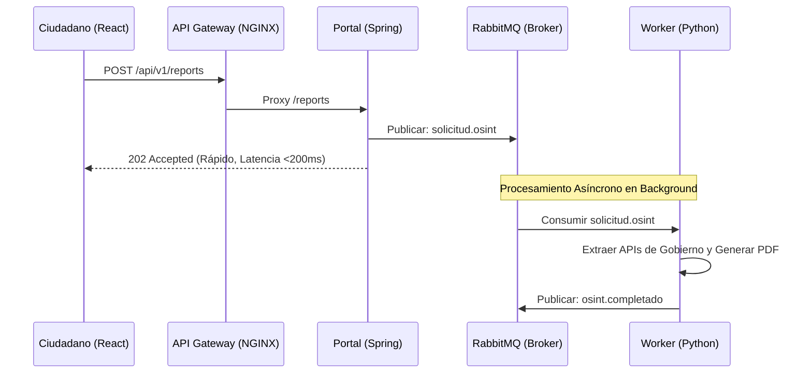

# Plataforma OSINT Ecuador — Ecosistema de Arquitectura de Software

Este es el repositorio unificado de la **Plataforma OSINT Ecuador**, un ecosistema de software desacoplado y diseñado mediante una **Arquitectura Orientada a Eventos (EDA)** y una persistencia políglota para el procesamiento y auditoría automatizada de antecedentes y cumplimiento normativo.

> [!IMPORTANT]
> **Disclaimer / Descargo de Responsabilidad:**  
> Este proyecto ha sido desarrollado exclusivamente con **fines académicos y educativos** para la materia de *Arquitectura y Diseño de Software*.  
> La recopilación automatizada de información en fuentes públicas (OSINT) aquí implementada simula un entorno real. Para cualquier implementación en producción o de carácter público, y de conformidad con la **Ley Orgánica de Protección de Datos Personales (LOPDP)** de la República del Ecuador (o normativas internacionales equivalentes), es mandatorio contar con la **debida autorización expresa e informada** del titular de los datos personales antes de realizar cualquier tipo de tratamiento, almacenamiento o perfilamiento de su información. El uso indebido o no autorizado de estas técnicas de extracción de datos fuera de este ámbito simulado es responsabilidad exclusiva del usuario.

Elaboradores: **Sara Chiriboga, Samuel Chalá, Anthonny Llanos y Martina Damián**  
Curso: **Arquitectura y Diseño de Software — Examen Progreso 2**

---

## 📋 Matriz de Cumplimiento de Requisitos (Ruta de Archivos)

A continuación se detalla dónde encontrar cada requerimiento obligatorio de la consigna dentro de este repositorio:

| Requerimiento Obligatorio | Detalle de Implementación | Ubicación en el Repositorio |
| :--- | :--- | :--- |
| **Ecosistema de ≥ 3 Aplicaciones** | 3 Sistemas independientes en ejecución: App 1 (Extracción), App 2 (Portal Ciudadano) y App 3 (Compliance Engine). | [app1-worker/](app1-worker/), [app2-portal/](app2-portal/), [app3-compliance/](app3-compliance/) |
| **Capas de Datos en Docker** | Cada motor de persistencia levantado en su propio contenedor Docker aislado en subredes. | [docker-compose.yml](docker-compose.yml) |
| **Uso de Lambdas (Serverless)** | Función serverless que levanta una instancia de Chrome headless para renderizar reportes en PDF. | [app1-worker/lambda-pdf/](app1-worker/lambda-pdf/) |
| **Gestor de Colas (Message Broker)** | RabbitMQ canalizando eventos asíncronos con reintentos y colas de descarte (DLQ). | [app4-platform/rabbitmq-config/](app4-platform/rabbitmq-config/) |
| **API Gateway Centralizado** | Proxy reverso NGINX exponiendo rutas `/api/v1/` seguras con TLS/HTTPS. | [app4-platform/gateway-config/](app4-platform/gateway-config/) |
| **Documentación de APIs con Swagger** | Contratos OpenAPI v3 en formato YAML que definen los esquemas y respuestas de los servicios. | [docs/api-specifications/](docs/api-specifications/) |
| **Diagramas C4 (IcePanel)** | Guía detallada y archivos de modelado de Contexto, Contenedores y Componentes lógicos. | [docs/c4-diagrams/](docs/c4-diagrams/) y [Espacio de Trabajo IcePanel](https://s.icepanel.io/RgGaoI1h5szF8v/wp3A) |
| **Diagrama de Despliegue** | Topología de red Docker y nodos de hardware en notación UML formal de cubos 3D. | [DiagramaDespliegueOSINT.drawio](DiagramaDespliegueOSINT.drawio) |
| **Integración Continua (CI/CD)** | Pipelines automáticos de GitHub Actions para compilación, testing y empaquetamiento Docker. | [.github/workflows/](.github/workflows/) |
| **Monitoreo** | Pipeline de observabilidad centralizada con Logstash, Elasticsearch y Kibana. | [app4-platform/elk-config/](app4-platform/elk-config/) |

---

## 🔄 Flujo de Trabajo Extremo a Extremo

El ecosistema opera mediante una coreografía que combina llamadas síncronas HTTP/REST rápidas en el frontend y procesamiento pesado asíncrono en el backend:

### 🖥️ 1. Fase de Solicitud
1. **Petición del Usuario:** El ciudadano ingresa su Cédula de Identidad y correo en la aplicación de React del Portal (App 2). El cliente valida en JavaScript que la cédula cumpla con la regla del módulo 10 (cédula ecuatoriana válida).
2. **Control de Tráfico y Seguridad:** La solicitud viaja vía HTTPS al **API Gateway NGINX** (App 4), el cual valida el certificado SSL, aplica reglas de *Rate Limiting* (límite de 5 peticiones por minuto por IP) y reenvía la petición al backend de Spring Boot (`app2-backend:8080`).
3. **Idempotencia con Redis:** El backend de la App 2 recibe la petición y verifica en **Redis** (`app2-redis`) si existe una consulta activa para esa cédula (`lock:reporte:{cedula}`). Si existe un candado, responde un código de error `409 Conflict` inmediato. Si no, genera un bloqueo de 10 minutos.
4. **Registro Transaccional Inicial:** Se crea un registro de la solicitud en la base de datos relacional **PostgreSQL** de la App 2 con estado `PROCESSING` y se le asigna un UUID único (`requestId`).
5. **Respuesta Rápida (202 Accepted):** El backend publica el evento `solicitud.osint` en el broker de mensajería **RabbitMQ** y responde al frontend con un código HTTP `202 Accepted` y el `requestId` en menos de **200 milisegundos**, liberando la conexión de red del ciudadano.

### ⚙️ 2. Fase de Extracción OSINT
6. **Consumo del Evento:** El motor extractor `app1-worker` (escrito en Python) consume el evento `solicitud.osint` de RabbitMQ de forma asíncrona.
7. **Extracción Multifuente:** El worker realiza peticiones HTTP concurrentes a las APIs gubernamentales ecuatorianas simuladas en el contenedor `app1-gov-mock` para extraer datos en crudo de:
   - **Registro Civil** (Nombres, Fecha de Nacimiento, Estado Civil).
   - **SRI** (Existencia de RUC y estado tributario).
   - **IESS** (Afiliación patronal y aportaciones).
   - **ANT** (Puntos de licencia de conducir y multas).
   - **SENESCYT** (Títulos de educación superior).
8. **Persistencia NoSQL:** Los JSONs en bruto extraídos de cada institución se guardan en la base de datos documental **MongoDB** (`app1-mongodb`) con el identificador `requestId`, garantizando la preservación de los payloads originales sin forzar esquemas rígidos.

### 📄 3. Fase de Generación de Reporte y PDF
9. **Invocación de la Lambda:** El worker de Python invoca a la función serverless de Node.js `app1-lambda-pdf`.
10. **Renderizado Headless:** La Lambda inicia un navegador *Chromium Headless* usando Puppeteer, inyecta los datos de MongoDB en una plantilla HTML con estilos modernos y exporta el reporte consolidado a formato PDF.
11. **Almacenamiento de Objetos (S3):** La Lambda sube el PDF generado a un bucket en el motor mock de almacenamiento de objetos **LocalStack S3** (`app4-localstack`), generando una URL de descarga segura y firmada.
12. **Actualización de Estado:** El worker actualiza el registro en MongoDB, guarda la URL del PDF en la base de datos PostgreSQL de la App 2 y publica el evento `osint.completado` en RabbitMQ.

### ⚖️ 4. Fase de Compliance y Auditoría
13. **Cruce de Listas de Sanciones:** El backend de Compliance de la App 3 consume el evento `osint.completado`.
14. **Conexión Externa a OpenSanctions:** Envía el nombre completo y la fecha de nacimiento del ciudadano a la API de **OpenSanctions** para verificar coincidencias en listas de terrorismo, lavado de activos y Personas Expuestas Políticamente (PEPs).
15. **Detección de Riesgos:** Si la API devuelve una coincidencia con un puntaje de similitud fonética superior al 80%, la App 3 genera una alerta con nivel `HIGH` en su PostgreSQL transaccional y publica el evento `alerta.compliance` en RabbitMQ.
16. **Indexación Analítica:** Paralelamente, la App 3 indexa los metadatos del ciudadano y su reporte en el clúster de **Elasticsearch** para habilitar búsquedas difusas inmediatas a los analistas a través de su Dashboard.

### 🔔 5. Fase de Notificación y Gatillo Final
17. **Mensajería Push en Tiempo Real:** El servicio `app4-notifications` (Spring Boot WebSockets) consume los eventos `reporte.listo` y `alerta.compliance` desde RabbitMQ y empuja una notificación push WebSockets a las pantallas del Dashboard de Analista y del Portal del Ciudadano.
18. **Visualización y Descarga:** La pantalla del Ciudadano cambia automáticamente a "Reporte Listo" y muestra el botón para descargar el PDF desde LocalStack S3.
19. **Envío de Correo:** Al mismo tiempo, el navegador del ciudadano dispara una llamada API al servicio externo de **EmailJS/Gmail** para enviar un correo electrónico formal al usuario con el enlace seguro de descarga de su reporte OSINT.

---

## 📐 Detalle Tecnológico de la Arquitectura

### 1. Desacoplamiento mediante Coreografía de Eventos (EDA)
El sistema no utiliza llamadas síncronas HTTP entre microservicios para evitar el acoplamiento y el bloqueo de hilos. En su lugar, utiliza **RabbitMQ** como bus de mensajes bajo el siguiente flujo:
1.  **`solicitud.osint`:** Publicado por el Portal (App 2) al recibir una solicitud ciudadana.
2.  **`osint.completado`:** Publicado por el Worker (App 1) tras extraer la información y guardar el reporte en MongoDB y S3.
3.  **`alerta.compliance`:** Emitido por el motor de Compliance (App 3) si el análisis arroja coincidencias de riesgo con listas PEP/sanciones.
4.  **`reporte.listo`:** Emitido al final para gatillar notificaciones WebSockets en tiempo real al ciudadano.



### 2. Aislamiento de Redes Lógicas
Para proteger la integridad de las bases de datos transaccionales, se configuran **4 redes Docker aisladas** en [docker-compose.yml](./docker-compose.yml):
*   `net-transit`: Contiene el Gateway, RabbitMQ y notificaciones. Es la única red expuesta.
*   `net-app1`: Subred para el Worker, la Lambda PDF y MongoDB. Aislada de las APIs de negocio.
*   `net-app2`: Subred para el Portal Backend, su base de datos PostgreSQL y Redis.
*   `net-app3`: Subred para el Compliance Backend, su PostgreSQL y Elasticsearch.
*   *Restricción:* Ninguna base de datos acepta conexiones de redes ajenas.

### 3. Persistencia Políglota
Cada microservicio utiliza la tecnología de datos que mejor se adapta a su modelo de lectura y escritura:
*   **PostgreSQL 15 (Relacional):** Utilizado en App 2 y App 3 para garantizar consistencia transaccional (ACID) sobre las solicitudes y alertas.
*   **MongoDB 6.0 (Documental):** Utilizado en App 1 para almacenar los payloads altamente variables y semiestructurados de las respuestas gubernamentales (IESS, SRI, etc.).
*   **Redis 7 (Memoria / Caché):** Utilizado en App 2 para control de duplicados e idempotencia mediante locks de corta duración.
*   **Elasticsearch 8 (Motor de Búsqueda):** Utilizado en App 3 para búsquedas rápidas, análisis de texto e indexación fonética sobre los reportes procesados.
*   **LocalStack S3 (Almacenamiento de Objetos):** Servidor local mock que emula Amazon S3 para guardar los PDFs finales firmados de forma segura.

---

## ⚡ Análisis de Atributos de Calidad

Las justificaciones completas se encuentran detalladas en la carpeta [docs/quality-attributes/](./docs/quality-attributes/). A continuación se presenta una síntesis de las decisiones tomadas:

*   **Caché e Idempotencia ([Ver Detalle](./docs/quality-attributes/app2-cache-idempotency.md)):** Se implementa Redis bajo el patrón *Cache-Aside* para evitar consultas repetitivas a base de datos. Para evitar que el usuario de doble click y procese dos veces la misma cédula, se establece un Lock de Idempotencia en Redis de 10 minutos.
*   **Concurrencia y Latencia ([Ver Detalle](./docs/app1-rate-limiting.md)):** El API Gateway elije un algoritmo de control de tasa (*Token Bucket Rate Limiting*) configurado en 5 peticiones por minuto por dirección IP, previniendo ataques de denegación de servicio (DoS) y protegiendo a los microservicios internos.
*   **Redundancia y Disponibilidad ([Ver Detalle](./docs/quality-attributes/seguridad_redundancia.md)):** RabbitMQ implementa colas de descarte (Dead Letter Queues) para manejar fallas en el procesamiento de APIs de gobierno. Si una extracción falla, el mensaje se redirige a `solicitud.dlq` para reintentos progresivos sin perder información.
*   **Indexación y Búsqueda ([Ver Detalle](./docs/quality-attributes/indexacion_busqueda.md)):** Elasticsearch indexa el texto completo de los reportes OSINT. Se configura el analizador de español (`spanish_analyzer`) con búsqueda difusa (Fuzzy Search por distancia de Levenshtein) y análisis fonético para evitar que errores tipográficos en los nombres oculten alertas de lavado de activos o PEPs.
*   **Costo, Rendimiento y Balanceo ([Ver Detalle](./docs/quality-attributes/costos_performance_balanceo.md)):** 
    *   *Balanceo:* NGINX balancea las solicitudes HTTP Round-Robin entre las réplicas del Backend, y RabbitMQ balancea las tareas de fondo mediante consumidores competidores elásticos con límite de prefetch.
    *   *Costo:* Al empaquetar el generador de PDF (Chrome Headless) como una función Serverless Lambda (FaaS), se proyecta una reducción del **80% de costos de CPU/RAM** en comparación con mantener servidores estables encendidos las 24 horas.

---

## ⚙️ Instrucciones de Despliegue Rápido

> [!IMPORTANT]
> **Directorio de Ejecución:** Todos los comandos descritos a continuación deben ser ejecutados desde la **raíz del proyecto** (la carpeta principal que contiene el archivo `docker-compose.yml`).

1.  **Asegurar Prerrequisitos:** Tener instalado Docker y Docker Compose.
2.  **Iniciar el Ecosistema Completo:**
    Ejecutar desde la terminal en la raíz del repositorio:
    ```bash
    docker-compose up -d
    ```
    *Esto levantará las bases de datos, RabbitMQ, los backends de Spring Boot, los frontends de React y el Gateway NGINX.*
3.  **Iniciar con Monitoreo:**
    ```bash
    docker-compose --profile elk up -d
    ```
4.  **URLs de Acceso:**
    *   **Portal Ciudadano:** `http://localhost:5173`
    *   **Dashboard de Compliance:** `http://localhost:5174`
    *   **API Gateway (HTTPS seguro):** `https://localhost`
    *   **Administrador de RabbitMQ:** `http://localhost:15672` usando las credenciales predeterminadas `guest` / `guest`.
