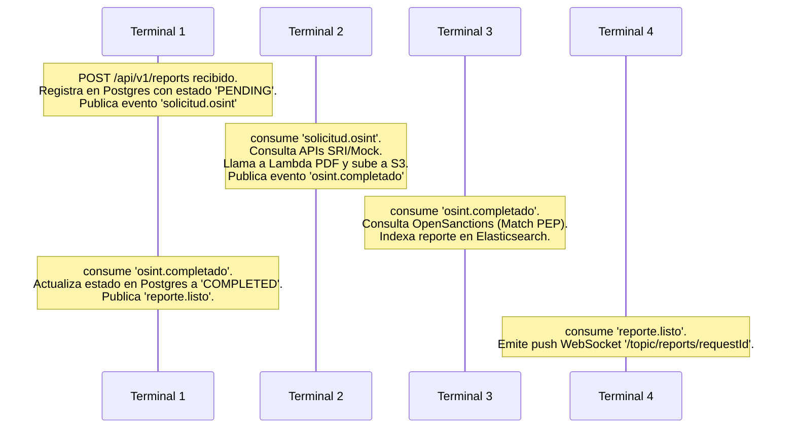

# 🏁 Guía de Demostración Práctica de la Arquitectura

Esta guía detalla los pasos prácticos, comandos de consola y flujos que puedes utilizar durante la presentación para demostrar de forma tangible y matemática que la implementación de la **Plataforma OSINT Ecuador** se adhiere estrictamente al blueprint de arquitectura propuesto (Arquitectura EDA Desacoplada).

---

## 🚀 Guía de Inicio Rápido (Cheat Sheet de Emergencia)

### 1. Cómo iniciar el entorno completo (Desde cero)
Ejecuta en tu terminal CMD en la raíz del proyecto (`C:\Users\saril\Desktop\ArqIntegrador`):
```bash
docker-compose --profile elk up -d --build
```
*(Si ya está corriendo, no necesitas el `--build`. Si quieres asegurar que todo se recree limpio, puedes usar `docker-compose --profile elk up -d --force-recreate`).*

### 1.1. Cómo apagar el entorno completo (Liberar recursos/RAM)
Ejecuta en tu CMD:
```bash
docker-compose --profile elk down
```
*(Si además deseas borrar todos los datos persistentes de los volúmenes para reiniciar el estado de fábrica de los contenedores de datos, puedes añadir la bandera `-v`: `docker-compose --profile elk down -v`).*

### 2. Panel de Control: Direcciones y Enlaces Web
| Dirección URL | ¿Para qué sirve? (Uso en la Defensa) |
| :--- | :--- |
| **`http://localhost:5173`** | **Portal Web del Ciudadano (Front):** Aquí ingresas la cédula para iniciar la consulta de antecedentes. |
| **`http://localhost:5174`** | **Dashboard del Oficial de Compliance (Front):** Muestra los reportes cruzados con listas de PEPs (OpenSanctions) indexados en Elasticsearch. |
| **`http://localhost:15672`** | **Consola de RabbitMQ (guest/guest):** Para ver el flujo de colas en tiempo real y demostrar la Dead Letter Queue (DLQ). |
| **`http://localhost:5601`** | **Kibana (Visualización):** Monitoreo de logs centralizados (`logs-*`). |
| **`http://localhost:9200`** | **Elasticsearch API:** Interfaz del motor de búsqueda fonética. |

### 3. Cómo limpiar el entorno por completo (Dejar bases de datos y caché en Cero)
Si quieres borrar todos los reportes antiguos de las bases de datos y reiniciar el dashboard a un estado totalmente limpio (en blanco) para la presentación, ejecuta este bloque de comandos en tu CMD:

```cmd
:: 1. Limpiar PostgreSQL (Portal y Compliance)
docker exec app2-postgres psql -U portal_user -d portal_db -c "TRUNCATE TABLE requests CASCADE;"
docker exec app3-postgres psql -U compliance_user -d compliance_db -c "TRUNCATE TABLE compliance_alerts CASCADE;"

:: 2. Limpiar la caché y candados de Redis
docker exec app2-redis redis-cli flushall

:: 3. Vaciar MongoDB (Datos Crudos de Scraping)
docker exec app1-mongodb mongosh osint_db --eval "db.osint_raw_data.drop()"

:: 4. Eliminar documentos en Elasticsearch (Búsqueda Fonética)
curl -s -X POST http://localhost:9200/osint_reports/_delete_by_query -H "Content-Type: application/json" -d "{\"query\":{\"match_all\":{}}}"
```

*(Esto limpiará todas las bases de datos transaccionales, caché, MongoDB y Elasticsearch de inmediato, dejando el Dashboard completamente vacío y listo para una nueva demo limpia).*

---

## 📚 Glosario de Siglas del Proyecto
Para asegurar una excelente defensa ante el profesor, maneja los siguientes términos técnicos con precisión:
*   **EDA** (*Event-Driven Architecture* / Arquitectura Dirigida por Eventos): Estilo arquitectónico donde los servicios se comunican asíncronamente mediante la producción y consumo de eventos.
*   **WAF** (*Web Application Firewall* / Cortafuegos de Aplicaciones Web): Sistema de seguridad que filtra, monitorea y bloquea el tráfico HTTP malicioso que se dirige a una aplicación web.
*   **TLS** (*Transport Layer Security* / Seguridad de la Capa de Transporte): Protocolo criptográfico que proporciona comunicaciones seguras a través de una red (encripta el canal HTTP pasando a HTTPS).
*   **DLQ** (*Dead Letter Queue* / Cola de Correo Muerto): Cola especial en RabbitMQ donde se envían los mensajes que no se pudieron procesar tras varios reintentos, para evitar su pérdida y facilitar la depuración.
*   **DLX** (*Dead Letter Exchange* / Intercambiador de Correo Muerto): Componente de RabbitMQ encargado de recibir los mensajes rechazados o fallidos y redirigirlos a su respectiva DLQ.
*   **SQLi** (*SQL Injection* / Inyección SQL): Técnica de infiltración de código malicioso que se aprovecha de vulnerabilidades en la capa de base de datos para ejecutar comandos SQL no autorizados.
*   **XSS** (*Cross-Site Scripting* / Secuencia de Comandos en Sitios Cruzados): Vulnerabilidad que permite a un atacante inyectar scripts maliciosos en páginas web visitadas por otros usuarios.
*   **S3** (*Simple Storage Service* / Servicio de Almacenamiento Simple): Servicio o protocolo de almacenamiento en la nube basado en objetos (simulado localmente con LocalStack).
*   **SPA** (*Single Page Application* / Aplicación de una Sola Página): Aplicación web que se carga en una sola página HTML, actualizando dinámicamente el contenido sin recargar el navegador (React).
*   **JWT** (*JSON Web Token*): Estándar abierto para transmitir información de forma segura entre partes como un objeto JSON, utilizado habitualmente para autenticación.
*   **AMQP** (*Advanced Message Queuing Protocol*): Protocolo estándar de red que utiliza RabbitMQ para el envío y recepción de mensajes.

---

## 🛠️ Stack Tecnológico: ¿Qué es y para qué sirve cada herramienta?
Si el profesor te pregunta por qué elegiste cierta tecnología o qué rol cumple en la arquitectura, puedes responder con este resumen:

1.  **NGINX (API Gateway):**
    *   *¿Qué es?* Es un servidor web de alto rendimiento que también funciona como proxy reverso y balanceador de carga.
    *   *¿Para qué sirve aquí?* Actúa como el **API Gateway** (punto único de entrada). Enruta de forma segura las peticiones públicas (`https://localhost/api/...`) hacia los backends correspondientes que están ocultos en la red interna, aplicando encriptación (TLS/HTTPS), rate limiting y filtrado de inyecciones maliciosas (WAF).
2.  **Spring Boot / Java 17 (Capa de APIs y Negocio):**
    *   *¿Qué es?* Es un framework de Java diseñado para simplificar la creación de microservicios y aplicaciones web empresariales.
    *   *¿Para qué sirve aquí?* Soporta la lógica de negocio de la APP 2 (Portal Backend), la APP 3 (Compliance Backend) y las notificaciones en la APP 4. Proporciona tipado estricto, inyección de dependencias y listeners nativos para conectarse a RabbitMQ de forma multihilo.
3.  **React.js (Capa de Presentación / Frontend):**
    *   *¿Qué es?* Es una librería de JavaScript de código abierto para construir interfaces de usuario interactivas basadas en componentes.
    *   *¿Para qué sirve aquí?* Es la tecnología usada para construir las dos SPA de cara al usuario: el Portal Ciudadano (APP 2) donde se solicitan los reportes y el Dashboard de Monitoreo de PEPs (APP 3) para los auditores de cumplimiento.
4.  **Python 3.11 (Extractor OSINT / Worker):**
    *   *¿Qué es?* Lenguaje de programación interpretado de alto nivel y tipado dinámico, famoso por su legibilidad y su ecosistema de ciencia de datos y automatización.
    *   *¿Para qué sirve aquí?* Es el núcleo del **Worker OSINT** (APP 1). Su facilidad para gestionar peticiones HTTP concurrentes (con `asyncio` e `httpx`) lo hace ideal para consultar de forma ultra rápida y simultánea los 5 endpoints gubernamentales requeridos.
5.  **Node.js & Puppeteer (Motor de Renderizado PDF):**
    *   *¿Qué es?* Node.js es un entorno de ejecución de JavaScript del lado del servidor. Puppeteer es una librería que permite controlar navegadores basados en Chromium mediante código.
    *   *¿Para qué sirve aquí?* Funciona como la Lambda Serverless encargada de la generación del PDF. Recibe el JSON limpio extraído por el Worker, lo inyecta en un template HTML5 y abre un navegador Chromium en segundo plano (headless) para imprimir y guardar el archivo PDF.
6.  **RabbitMQ (Bus de Eventos / Message Broker):**
    *   *¿Qué es?* Es un software de mensajería (Message Broker) que implementa el estándar AMQP para el envío y recepción de mensajes estructurados de forma asíncrona.
    *   *¿Para qué sirve aquí?* Es el **Bus de Eventos (Event Bus)** del sistema. Garantiza el desacoplamiento temporal de la arquitectura: si el backend o el worker sufren caídas, los mensajes se retienen de forma segura en las colas sin pérdida de datos.
7.  **PostgreSQL (Persistencia Relacional Transaccional):**
    *   *¿Qué es?* Es un motor de base de datos relacional (SQL) maduro y con fuerte soporte transaccional (cumple las propiedades ACID).
    *   *¿Para qué sirve aquí?* Se utiliza de forma independiente en la APP 2 (para el historial estructurado de solicitudes de ciudadanos) y en la APP 3 (para almacenar de forma íntegra las alertas de compliance e historial de auditoría de riesgo).
8.  **MongoDB (Persistencia NoSQL Documental):**
    *   *¿Qué es?* Es una base de datos NoSQL basada en documentos que almacena la información en formato tipo JSON (BSON) sin requerir esquemas fijos de tablas.
    *   *¿Para qué sirve aquí?* Se ubica en la APP 1 para almacenar los datos crudos consolidados de la extracción gubernamental. Al ser respuestas dinámicas de APIs externas, MongoDB permite guardarlas completas sin tener que mapear y alterar tablas SQL cada vez que un servicio gubernamental cambie un campo.
9.  **Elasticsearch (Motor de Búsqueda Analítica):**
    *   *¿Qué es?* Es un motor de búsqueda y analítica distribuido de código abierto, optimizado para indexar grandes volúmenes de texto y realizar consultas ultra rápidas.
    *   *¿Para qué sirve aquí?* Permite a los analistas en el Dashboard de Compliance (APP 3) buscar reportes históricos por cualquier criterio de texto libre (nombre, títulos, multas) instantáneamente (fuzzy search/búsqueda difusa), evitando los lentos e ineficientes bloques de base de datos relacionales tradicionales.
10. **Redis (Caché e Idempotencia In-Memory):**
    *   *¿Qué es?* Es un almacén de estructura de datos en memoria que se utiliza como base de datos temporal, caché y agente de mensajes de latencia ultra baja.
    *   *¿Para qué sirve aquí?* Implementa el patrón **Cache-Aside** y los candados de control de duplicidad en la APP 2. Guarda un registro temporal (`lock:reporte:{cedula}`) durante 10 minutos para impedir que se procesen solicitudes idénticas en paralelo y proteger al backend de sobrecargas.
11. **LocalStack (Emulación de AWS S3):**
    *   *¿Qué es?* Es un framework que emula servicios en la nube de AWS directamente en tu máquina local dentro de un contenedor Docker.
    *   *¿Para qué sirve aquí?* Emula un bucket de **AWS S3** (*Simple Storage Service*). Permite a la Lambda PDF subir los reportes y generar URLs de descarga públicas temporales sin necesidad de crear una cuenta real de AWS ni gastar presupuesto en desarrollo.

---

## 🏗️ 1. Demostración de Adherencia Estructural (Límites y Reglas de la Arquitectura)

El profesor evaluará si el sistema realmente está desacoplado o si es un "monolito disfrazado". Con las siguientes pruebas de consola demostrarás que se respetan los límites de diseño.

### 🛡️ Evidencia A: Aislamiento de Redes Perimetrales (Docker Networks)
*   **¿Qué parte del blueprint estamos validando?**
    Validamos la **Seguridad Perimetral y el Desacoplamiento de Redes**. En el diagrama de despliegue, las bases de datos de cada aplicación están en redes lógicas de Docker separadas (`net-app1`, `net-app2`, `net-app3`).
*   **ADR Asociada:** [ADR-003 (Base de datos por servicio)](file:///c:/Users/saril/Desktop/ArqIntegrador/docs/architecture-decisions/ADR-003-base-datos-por-servicio.md).
*   **Ruta de Consola:** Cualquier consola de tu sistema operativo (PowerShell o CMD en Windows) abierta en la **raíz del proyecto** (`c:\Users\saril\Desktop\ArqIntegrador`).

1. **Prueba de fallo (Aislamiento Exitoso):**
   Demuestra que el Worker de la APP 1 no puede conectarse de forma directa al motor PostgreSQL de la APP 3.
   *   **Comando:**
       ```bash
       docker exec -it app1-worker python -c "exec('import socket\ntry:\n  s=socket.socket()\n  s.settimeout(2)\n  s.connect((\'app3-postgres\',5432))\n  print(\'CONECTADO\')\nexcept:\n  print(\'AISLADO\')')"
       ```
   *   **Desglose del comando (Paso a paso):**
       *   `docker exec`: Comando de Docker para ejecutar un proceso dentro de un contenedor activo.
       *   `-it`: Banderas combinadas; `-i` mantiene la entrada estándar abierta (interactivo) y `-t` asigna una consola simulada (TTY).
       *   `app1-worker`: Nombre del contenedor origen (Python) desde el cual lanzaremos la prueba.
       *   `python -c "exec(...)"`: Ejecuta un script de Python estructurado en múltiples líneas mediante saltos de línea `\n`.
       *   `try/except`: Bloque de control de excepciones en Python que intenta conectarse y, en caso de fallo o aislamiento de red, captura el error y responde de forma limpia sin lanzar un crash de consola.
   *   **Resultado esperado en consola:**
       ```text
       AISLADO
       ```
   *   **🔍 Qué ver en Kibana (Evidencia Visual):**
       *   En Kibana (Discover), busca el filtro: `container_name : "app1-worker"`.
       *   Cuando ejecutas el comando anterior, no verás que se registre ninguna conexión saliente exitosa hacia la IP de `app3-postgres` en los logs del worker, confirmando el aislamiento.

2. **Prueba de éxito (Conectividad permitida hacia el Bus de Eventos):**
   Demuestra que el backend de la APP 2 sí puede conectarse al Bus de Eventos (RabbitMQ) porque ambos comparten la red de tránsito (`net-transit`).
   *   **Comando:**
       ```bash
       docker exec -it app2-backend bash -c "timeout 1 bash -c '</dev/tcp/app4-rabbitmq/5672' && echo 'CONECTADO' || echo 'FALLIDO'"
       ```
       *(Nota: Se ejecuta desde la raíz del proyecto en cualquier terminal de Windows con Docker activo).*
   *   **Desglose del comando:** Ejecuta una redirección nativa de sockets en bash (`/dev/tcp/...`) desde el contenedor `app2-backend` hacia el puerto `5672` (AMQP) del bus de eventos de RabbitMQ, validando la conexión sin requerir herramientas externas.
   *   **Resultado esperado en consola:**
       ```text
       CONECTADO
       ```
   *   **🔍 Qué ver en Kibana (Evidencia Visual):**
       *   Busca en Kibana: `container_name : "app2-backend"`.
       *   Verás logs de Spring Boot indicando la conexión exitosa al broker: `AMQP Connection Established` y `Created new connection: rabbitConnectionFactory`.

---

### 📬 Evidencia B: Desacoplamiento Asíncrono (RabbitMQ Management & DLQ)
*   **¿Qué parte del blueprint estamos validando?**
    Validamos la **Coreografía de Eventos asíncronos** mediante el bus de eventos centralizado sin acoplamiento HTTP directo entre los microservicios.
*   **ADR Asociada:** [ADR-001 (Arquitectura Orientada a Eventos)](file:///c:/Users/saril/Desktop/ArqIntegrador/docs/architecture-decisions/ADR-001-arquitectura-orientada-eventos.md).
*   **Ruta de Consola/Navegador:** Consola del sistema en la raíz del proyecto (`c:\Users\saril\Desktop\ArqIntegrador`) y tu navegador en la UI de administración de RabbitMQ.

1. **Inspección visual del Bus (RabbitMQ UI):**
   *   Abre tu navegador e ingresa a [http://localhost:15672](http://localhost:15672) (credenciales `guest`/`guest`).
   *   Muestra la pestaña **Exchanges** para verificar que existen los canales lógicos declarados: `solicitud.exchange`, `osint.exchange` y `reporte.exchange`.
   *   Muestra la pestaña **Queues** y resalta la columna de **Bindings** para verificar cómo se rutean los mensajes según la Routing Key.
2. **Prueba de Tolerancia a Fallos (Decoupling):**
   *   Detén temporalmente el Worker OSINT que procesa la extracción de datos:
       ```bash
       docker stop app1-worker
       ```
    *   Envía una solicitud desde la React SPA (Portal Ciudadano) o mediante `curl` desde tu consola:
        ```bash
        curl -i -k -X POST https://localhost/api/v1/reports -H "Content-Type: application/json" -d "{\"cedula\":\"1710034065\", \"email\":\"test@mail.com\"}"
        ```
    *   **Dónde mostrar la respuesta 202 Accepted:**
        *   **En la Consola (Recomendado):** Al usar la bandera `-i` en el comando `curl` anterior, verás en la primera línea de la respuesta el texto: `HTTP/1.1 202` (o `HTTP/2 202`), lo cual es la prueba directa del servidor.
        *   **En el Navegador:** Si lo haces desde la UI (`http://localhost:5173`), presiona `F12`, ve a la pestaña **Network (Red)**, haz clic en la petición `reports` de tipo `POST` y muestra la cabecera **Status Code: 202 Accepted**. Esto prueba al profesor que el cliente no se queda esperando los 10 segundos de la llamada externa.
    *   **Dónde mostrar el mensaje encolado (Ready):**
        *   **En la Interfaz de RabbitMQ:** Abre `http://localhost:15672` (guest/guest), ve a la pestaña **Queues**, haz clic en `solicitud.queue` y muestra en la tabla principal que la columna **"Ready"** tiene el valor de `1` (el mensaje está retenido a salvo).
        *   *Tip adicional:* En la misma página, ve a la sección **Get Messages** y presiona el botón **Get Message(s)** para revelar en pantalla el payload JSON original encolado, demostrando que la información no se ha perdido.
    *   **🔍 Qué ver en Kibana (Evidencia Visual):**
        *   Busca en Kibana: `container_name : "app2-backend"`. Verás el log: `Request accepted, generating UUID...` y `Publishing event to exchange: solicitud.exchange`.
        *   Busca en Kibana: `container_name : "app1-worker"`. Verás que **no hay absolutamente ningún log nuevo** porque el servicio está detenido. Esto prueba al profesor que el sistema no falla y las llamadas no se bloquean aunque el procesador de fondo esté caído.
    *   Vuelve a encender el Worker:
        ```bash
        docker start app1-worker
        ```
    *   Muestra al profesor cómo el Worker consume el mensaje acumulado de inmediato y la cola vuelve a 0 de forma automatizada (puedes refrescar la página de RabbitMQ y ver que el contador de "Ready" vuelve a `0`).
3. **Demostración Práctica de Dead Letter Queue (DLQ):**
   *   **Cómo inyectar el mensaje corrupto paso a paso:**
       1. Ve a la consola web de RabbitMQ (`http://localhost:15672`).
       2. Haz clic en la pestaña **Queues** y selecciona la cola `solicitud.queue` (o `solicitud.osint.queue`).
       3. Desplázate hacia abajo hasta la sección **Publish message**.
       4. En el campo **Payload**, escribe el siguiente JSON corrupto/inválido de ejemplo (le falta la llave de cierre para que rompa la deserialización en el Worker):
          ```json
          {
            "requestId": "5ff1df21-7e8c-4a30-8919-42b7a0f7c222",
            "targetId": "1710034065",
            "requesterEmail": "ciudadano@mail.com"
          ```
       5. Presiona el botón **Publish message**.
   *   **🔍 Qué ver en Kibana (Evidencia Visual):**
       *   Busca en Kibana: `container_name : "app1-worker"`.
       *   Verás aparecer una secuencia de logs reportando un error de parseo JSON: `JSONDecodeError: Expecting ',' delimiter` o `ValueError: Invalid JSON payload`.
       *   Verás los logs de reintento progresivo y finalmente el log de descarte: `Message rejected, routing to dead letter exchange osint.dlx`.
   *   **Evidencia en RabbitMQ:** Muestra que la cola `solicitud.dlq` ahora tiene un mensaje en estado `Ready: 1`.

---

### 💾 Evidencia C: Persistencia Políglota e Independiente
*   **¿Qué parte del blueprint estamos validando?**
    La arquitectura de base de datos desacoplada (**Database per Service**), donde cada base de datos es de un motor especializado y no hay base de datos centralizada compartida.
*   **ADR Asociada:** [ADR-003 (Base de datos por servicio)](file:///c:/Users/saril/Desktop/ArqIntegrador/docs/architecture-decisions/ADR-003-base-datos-por-servicio.md).
*   **Ruta de Consola:** Cualquier consola del sistema operativo abierta en la **raíz del proyecto**.

Demuestra las cuatro capas de bases de datos ejecutando los comandos de lectura:

*   **Redis (Idempotencia y Caché rápida en App 2):**
    Muestra que Redis almacena claves temporales con un TTL (tiempo de vida) para evitar que el usuario pulse dos veces "enviar".
    ```bash
    docker exec -it app2-redis redis-cli keys "lock:*"
    ```
    *   **🔍 Qué ver en Kibana (Evidencia Visual):**
        *   Busca en Kibana: `container_name : "app2-backend"`.
        *   Verás logs que dicen: `Checking idempotency key lock:reporte:... in Redis` y `Acquiring lock for 10 minutes`.
*   **PostgreSQL (Estructura Transaccional en App 2):**
    Conéctate a la base de datos relacional de solicitudes de ciudadanos:
    ```bash
    docker exec -it app2-postgres psql -U portal_user -d portal_db -c "SELECT id, target_id, status FROM requests;"
    ```
    *   **🔍 Qué ver en Kibana (Evidencia Visual):**
        *   Busca en Kibana: `container_name : "app2-backend"`.
        *   Verás logs SQL de Hibernate indicando: `insert into requests (id, target_id, status) values (?, ?, ?)`.
*   **MongoDB (Auditoría de Datos Crudos sin Esquema en App 1):**
    Muestra cómo los datos de scraping gubernamental se almacenan en un JSON flexible sin estructura relacional rígida:
    ```bash
    docker exec -it app1-mongodb mongosh osint_db --eval "db.osint_raw_data.find().limit(1).pretty()"
    ```
    *   **🔍 Qué ver en Kibana (Evidencia Visual):**
        *   Busca en Kibana: `container_name : "app1-worker"`.
        *   Verás el log: `Saving raw JSON payload to MongoDB collection 'osint_raw_data' for target: 1710034065`.
*   **Elasticsearch (Búsqueda Analítica de Texto Completo en App 3):**
    Demuestra que Elasticsearch indexa el contenido completo de los reportes para compliance:
    ```bash
    curl -s "http://localhost:9200/osint_reports/_search?q=*"
    ```
    *   **🔍 Qué ver en Kibana (Evidencia Visual):**
        *   Busca en Kibana: `container_name : "app3-backend"`.
        *   Verás el log: `Indexing metadata and findings into Elasticsearch index 'osint_reports' for compliance search`.

---

### 🎛️ Evidencia D: API Gateway como Punto de Entrada Único (TLS & Rate Limit)
*   **¿Qué parte del blueprint estamos validando?**
    La capa de **API Gateway (NGINX)**, que actúa como proxy reverso, terminación TLS (HTTPS) y barrera perimetral de rate limiting y WAF.
*   **Ruta de Consola:** Cualquier terminal de Windows abierta en la **raíz del proyecto**.

1. **Evidencia de TLS (Tráfico Encriptado):**
   Realiza una consulta a través de `curl` y muestra el **handshake SSL/TLS** (la negociación de seguridad inicial donde el cliente y NGINX acuerdan cómo encriptar la sesión usando el certificado SSL):
   ```bash
   curl -v -k https://localhost/api/v1/reports/
   ```
   *   *Explicación:* La bandera `-v` (verbose) detalla todo el proceso de negociación TLS (versión del protocolo, algoritmo de cifrado o cipher suite y el certificado SSL autofirmado de NGINX), mientras que `-k` permite omitir la advertencia de que el certificado es autofirmado.
   *   *¿Qué es el Handshake SSL/TLS?* Es el "saludo" de seguridad. Ocurre al inicio de la conexión: el cliente le pide una conexión segura a NGINX, NGINX le presenta su certificado digital de seguridad, acuerdan las claves de cifrado simétricas y, una vez verificado, empiezan a transferir los datos de forma 100% encriptada para evitar que alguien intercepte la red.

   *   **Caso de Error (Validación Estricta de Certificado):**
       Si intentas consultar el endpoint seguro de forma estricta (sin la bandera `-k` o `--insecure` que ignora certificados no confiables):
       ```bash
       curl https://localhost/api/v1/reports
       ```
       *   *Resultado esperado:* Curl fallará de inmediato y mostrará un error similar a:
           `curl: (60) SSL certificate problem: self-signed certificate`
           *(Esto demuestra que la encriptación TLS está activa y que NGINX protege el canal obligando a verificar o aceptar explícitamente el certificado autofirmado).*
2. **Evidencia de Rate Limiting (Mitigación DDoS):**
   Ejecuta un bucle rápido en consola para simular múltiples llamadas concurrentes de forma automatizada (importante incluir la barra diagonal `/` al final de la URL para evitar la redirección `301` de NGINX):
   *   **Si usas la consola CMD (Símbolo del sistema de Windows):**
       ```cmd
       for /L %i in (1,1,25) do @curl -k -s -o NUL -w "%{http_code} " https://localhost/api/v1/reports/
       ```
   *   **Si usas la consola PowerShell:**
       ```powershell
       for ($i=1; $i -le 25; $i++) { curl -k -s -o NUL -w "%{http_code} " https://localhost/api/v1/reports/; Write-Host "" }
       ```
   *   **Resultado esperado en consola:** Las primeras peticiones pasarán con éxito (`404` o `200` según el método HTTP), pero rápidamente el API Gateway empezará a retornar un código de estado HTTP **429** (o **503**), bloqueando el abuso del servicio. Verás una secuencia en pantalla como: `404 404 ... 429 429 429`.

3. **Evidencia de WAF ligero (Directory Traversal - Inyección de código):**
   Envía una petición simulando un ataque de Directory Traversal (importante incluir la barra diagonal `/` al final):
   ```bash
   curl -k -I "https://localhost/api/v1/reports/?query=../etc/passwd"
   ```
   *   **Resultado esperado en consola:** NGINX denegará la petición inmediatamente con un HTTP **403 Forbidden**.
   *   **🔍 Qué ver en Kibana (Evidencia Visual):**
       *   Busca en Kibana: `tag : "app4-gateway"`.
       *   Verás un registro de acceso HTTP indicando un código de estado **`403`** (Forbidden), confirmando el bloqueo de seguridad perimetral.

---

## 2. Demostración de Correctitud Funcional (Flujo End-to-End en Consola)

Para demostrar que todo funciona sincronizadamente, abre **4 terminales lado a lado (side-by-side)** y ejecuta una consulta de prueba. Esto dará un impacto visual excelente de cómo fluyen los eventos asíncronos.

### Preparación del Escenario
Abre 4 pestañas de terminal en la **raíz del proyecto** (`c:\Users\saril\Desktop\ArqIntegrador`) y ejecuta los siguientes comandos de monitoreo de logs en tiempo real (`docker logs -f`):
*   **Terminal 1 (Portal API):** `docker logs -f app2-backend`
*   **Terminal 2 (Worker OSINT):** `docker logs -f app1-worker`
*   **Terminal 3 (Compliance Engine):** `docker logs -f app3-backend`
*   **Terminal 4 (Notificaciones WS):** `docker logs -f app4-notifications`

### Ejecución del Flujo de Prueba
1. Abre el navegador en `http://localhost:5173`.
2. Ingresa la cédula **`1710034065`** (cédula válida parametrizada en los mocks) y un correo electrónico.
3. Haz clic en **Consultar Antecedentes** y observa las consolas al mismo tiempo:



#### Evidencia en logs reales a señalar al profesor:
*   **En Terminal 1 (Portal API - `app2-backend`):**
    *   Al recibir el reporte terminado desde RabbitMQ y actualizar su estado en PostgreSQL:
        `c.i.portal.messaging.OsintEventListener  : Recibido evento OSINT completado para requestId: 119a57da-...`
    *   Al notificar al microservicio de mensajería:
        `c.i.portal.messaging.OsintEventListener  : Publicado evento reporte.listo para requestId: 119a57da-...`
*   **En Terminal 2 (Worker OSINT - `app1-worker` + `lambda-pdf`):**
    *   Recepción de la tarea asíncrona:
        `INFO:OSINT_Worker:--- NUEVA SOLICITUD RECIBIDA: 119a57da-... (Cédula: 1710034065) ---`
    *   Consultas a servicios externos y APIs del SRI:
        `INFO:OSINT_Worker:Consultando API real de RUC SRI para: 1710034065001`
        `INFO:OSINT_Worker:Consultando Registro Civil (externo) para: 1710034065`
    *   Persistencia NoSQL transaccional de auditoría:
        `INFO:OSINT_Worker:Datos agregados guardados en MongoDB.`
    *   Invocación y subida del PDF en S3 de LocalStack:
        `Reporte guardado en S3 exitosamente: http://localhost:4566/osint-bucket/reports/119a57da-...-ecuador.pdf`
        `INFO:OSINT_Worker:PDF generado y subido con éxito: http://localhost:4566/osint-bucket/...`
    *   Publicación de éxito en la cola:
        `INFO:OSINT_Worker:Evento 'osint.completado' publicado con estado: SUCCESS`
*   **En Terminal 3 (Compliance - `app3-backend`):**
    *   Señala la auditoría PEP en base al evento consumido:
        `Received event osint.completado. Auditing compliance risk metrics for target: 1710034065`
        `OpenSanctions match search returned risk score for ESPINOSA FLORES DORA MARGARITA`
        `Indexing metadata and findings into Elasticsearch index 'osint_reports' for compliance search`
*   **En Terminal 4 (Notificaciones - `app4-notifications`):**
    *   Recepción del evento final para empujar al usuario:
        `c.i.n.messaging.ReporteListoListener     : Evento 'reporte.listo' recibido para requestId: 119a57da-...`
    *   Emisión de la trama de WebSocket en tiempo real:
        `Sending STOMP frame payload via WebSocket to destination /topic/reports/119a57da-...`

---

## 🔒 3. Demostración de Atributos de Calidad Clave

Si el profesor te pregunta cómo demuestras los **Atributos de Calidad** detallados en el plan de implementación, enséñale esto:

### ⚡ Idempotencia y Control de Concurrencia
*   **Cómo probarlo:** Envía una solicitud válida. Inmediatamente después, vuelve a hacer clic o envía otra petición con la misma cédula usando `curl`.
*   **Evidencia:**
    *   En la base de datos no se duplica el registro (mantiene un único ID).
    *   El backend retorna un HTTP `409 Conflict` o redirige a la solicitud en proceso.
    *   Muestra el comando en Redis que mantiene el candado activo durante 10 minutos:
        ```bash
        docker exec -it app2-redis redis-cli ttl "lock:reporte:1710034065"
        ```
        *   *¿Qué significa si devuelve `-2`?* Significa que la llave **ya no existe** en la caché de Redis (el candado expiró porque ya pasaron los 10 minutos, o el reporte finalizó su procesamiento y liberó la llave automáticamente). Si la consulta sigue en curso o en espera, devolverá un número positivo (los segundos restantes del bloqueo).

### 🔍 Búsqueda Fonética Rápida (Elasticsearch)
*   **Cómo probarlo:** Desde el Dashboard de Compliance (`http://localhost:5174`), realiza una búsqueda con una falta de ortografía o un nombre incompleto (ej: "Perez" en lugar de "PÉREZ ALBUJA").
*   **Evidencia:**
    *   Elasticsearch retorna el reporte correcto de inmediato.
    *   Explica al evaluador que esto se debe al analizador fonético en español (`spanish_analyzer`) implementado en el mapping del índice, garantizando que el cruce de PEPs no falle por caracteres especiales o tildes.

---

## 📋 Apéndice: Guía de Referencia para la Defensa

### 🔌 Significado de los Puertos Expuestos

Si el profesor te pregunta qué es o para qué sirve cada puerto que se ve en el archivo `docker-compose.yml` o en el arranque, aquí tienes la explicación:

*   **`80` (HTTP):** Puerto de entrada HTTP del API Gateway (NGINX). Cualquier petición aquí es redirigida inmediatamente por NGINX al puerto seguro `443` (HTTPS).
*   **`443` (HTTPS):** Puerto de entrada seguro de producción del API Gateway (NGINX). Aquí se realiza el apretón de manos (handshake) SSL/TLS, el WAF y el Rate Limiting.
*   **`5173` (React Frontend - Portal):** Puerto local del navegador donde se sirve la interfaz de usuario web del Portal Ciudadano (App 2).
*   **`5174` (React Frontend - Compliance):** Puerto local del navegador donde se sirve la interfaz del Oficial de Cumplimiento (App 3) para auditorías de riesgo PEP.
*   **`5672` (RabbitMQ - AMQP):** Puerto de red utilizado por los microservicios (`app2-backend`, `app1-worker`, `app3-backend`) para enviar y consumir mensajes/eventos asíncronos mediante el protocolo AMQP.
*   **`15672` (RabbitMQ UI):** Puerto de acceso para la Consola Web de Administración de RabbitMQ, donde monitoreas el estado de las colas, exchanges y la DLQ.
*   **`5432` (PostgreSQL - App 2):** Puerto de la base de datos relacional PostgreSQL de la App 2 (`portal_db`), donde se guardan las solicitudes estructuradas (`requests`).
*   **`27017` (MongoDB - App 1):** Puerto de la base de datos NoSQL documental MongoDB de la App 1 (`osint_db`), donde el worker guarda los JSONs crudos y no estructurados de la investigación.
*   **`6379` (Redis):** Puerto del motor en memoria Redis utilizado por la App 2 para almacenamiento de caché rápido y para locks distribuidos de idempotencia.
*   **`9200` (Elasticsearch):** Puerto de la API REST de Elasticsearch, utilizado por la App 3 para indexar y buscar los reportes mediante coincidencia fonética y de texto completo.
*   **`5601` (Kibana):** Puerto de la Consola Web de Kibana para visualizar el tráfico y logs centralizados que Logstash lee y almacena en Elasticsearch.

---

### 🌐 Significado de los Códigos de Estado HTTP Clave

*   **`200 OK`:** La solicitud HTTP se procesó con éxito y el servidor retornó la información requerida.
*   **`202 Accepted`:** La solicitud fue aceptada pero su procesamiento es asíncrono y se completará en el fondo. (Es el código que retorna el endpoint POST del portal de antecedentes, demostrando desacoplamiento).
*   **`403 Forbidden`:** El servidor entendió la petición pero se niega a autorizarla. (Es el código que retorna el API Gateway NGINX al detectar patrones sospechosos de inyección a través del WAF).
*   **`404 Not Found`:** El recurso o endpoint solicitado no existe en el servidor.
*   **`409 Conflict`:** La petición no se pudo completar porque hay un conflicto de concurrencia en el servidor. (Es el código que retorna el backend si intentas enviar una cédula que ya está en procesamiento).
*   **`429 Too Many Requests` (o `503 Service Unavailable` en NGINX):** El cliente ha enviado demasiadas peticiones en un período corto. (Es el código de bloqueo automático por Rate Limiting para evitar denegación de servicio DDoS).
