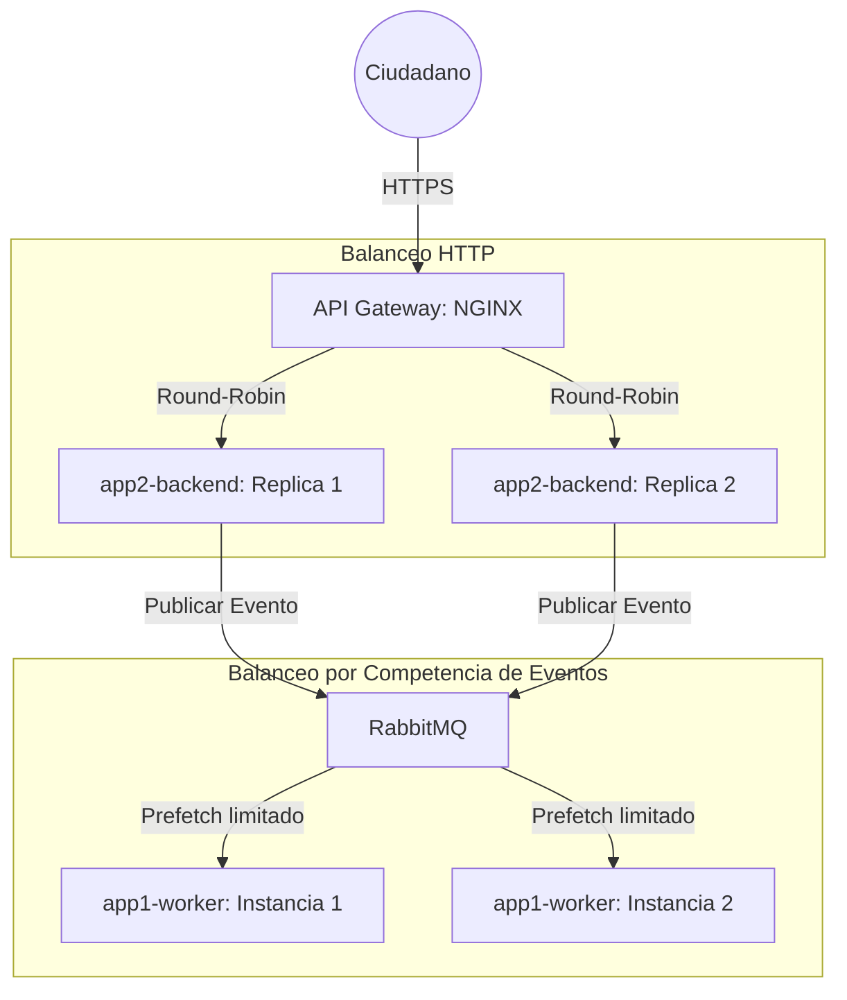

# Justificaciones de Arquitectura: Costos, Rendimiento y Balanceo

**Paquetes Asociados:** Paquete D (Plataforma e Integración) y Global  
**Tecnologías Claves:** NGINX, RabbitMQ, Redis, AWS Lambda (Serverless Node.js/Puppeteer)  

---

## 1. Costo y Proyección (Proyección Financiera e Infraestructura Híbrida)
Para garantizar la viabilidad financiera del proyecto a escala gubernamental, se seleccionó un modelo de **infraestructura híbrido**:

*   **Microservicios Constantes (Contenedores Docker):** Las APIs de Spring Boot, el Worker de Python y los motores de bases de datos (Postgres, Mongo, Elasticsearch) tienen demandas de cómputo y memoria constantes y predecibles. Son idóneos para ejecutarse en contenedores Docker de costo fijo mensual.
*   **FaaS / Serverless (Lambda para PDF):** La generación de reportes PDF usando Puppeteer requiere iniciar instancias internas de navegadores Chromium Headless. Esto genera picos extremos de CPU y RAM que duran pocos segundos.
    *   *Justificación de costos:* Mantener servidores dedicados listos para picos de renderizado es extremadamente costoso e ineficiente (capacidad ociosa del 90%). Implementar este motor como una **AWS Lambda** (serverless) garantiza facturación elástica por milisegundos de uso y escala a 0 cuando no hay consultas activas.

---

## 2. Balanceo de Carga (Load Balancing)
El balanceo de carga se implementa en dos capas distintas del ecosistema:

### A. Balanceo de Carga Perimetral (Capa HTTP)
*   **Implementación:** NGINX (`app4-gateway`) actúa como balanceador Round-Robin primario. Distribuye de forma equitativa las peticiones HTTP entrantes del Portal y del Dashboard hacia las réplicas internas del Backend de Solicitudes (App 2) y de Compliance (App 3).

### B. Balanceo por Competencia de Consumidores (Capa Asíncrona)
*   **Implementación:** A nivel de procesamiento de eventos, RabbitMQ actúa como balanceador elástico natural. Si la carga de solicitudes aumenta, se pueden instanciar múltiples contenedores de `app1-worker` sin reconfigurar la red.
*   *Mecanismo:* RabbitMQ reparte las tareas de `solicitud.queue` a los workers libres mediante políticas de prefetch limitado (`basic.qos = 1`), evitando que un worker sature de llamadas concurrentes a los servidores gubernamentales simulados.

---

## 3. Performance y Escalabilidad
La latencia combinada para consultar las 5 APIs gubernamentales de Ecuador oscila entre 5 y 15 segundos. Mantener un canal HTTP síncrono abierto durante ese tiempo bloquearía los hilos del servidor web.

*   **Coreografía Asíncrona (Tolerancia a Latencia):** El Portal responde en **menos de 200 milisegundos** con un código de estado `202 Accepted` y libera la conexión. El procesamiento se delega al bus RabbitMQ, aislando por completo la latencia pesada en los workers de background.
*   **Caché en Redis (Escalabilidad de Lectura):** Empleando el patrón **Cache-Aside**, las solicitudes finalizadas se sirven directamente desde MongoDB y la duplicidad concurrente de claves se gestiona en memoria con Redis (`lock:reporte:{cedula}` con TTL de 10 min). Esto elimina la latencia de red de las bases de datos transaccionales de PostgreSQL.
*   **Escalabilidad Horizontal Selectiva:** Si hay picos de usuarios, se escala horizontalmente la App 2 y la App 1 de forma independiente, dejando el motor de Compliance (App 3) operando con recursos estables sin gastar presupuesto innecesario.
