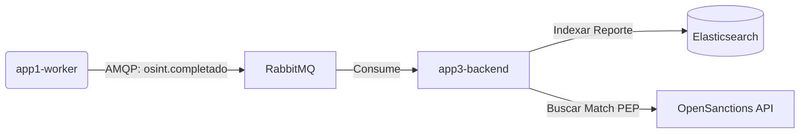

# Justificación de Arquitectura: Indexación y Búsqueda con Elasticsearch

**Paquete Asociado:** Paquete C (Dashboard y Motor de Compliance)  
**Tecnología Clave:** Elasticsearch 8.x  

---

## 1. El Desafío de la Búsqueda en Compliance
En el sistema de prevención de riesgos y cruce de información de **Personas Expuestas Políticamente (PEPs)** y listas de sanciones, la búsqueda exacta por base de datos relacional (ej: usando `SELECT ... WHERE nombre LIKE '%PEREZ%'`) presenta fallas arquitectónicas severas:
1.  **Falsos Negativos por Ortografía:** Si el analista busca "Juan Perez" y el registro gubernamental tiene tilde ("Juan Pérez") o errores comunes ("Juan Peres"), la consulta SQL fallará y el riesgo no será detectado.
2.  **Rendimiento y Bloqueos:** Las búsquedas con comodines (`LIKE '%...%'`) obligan al motor relacional a hacer escaneos de tabla completa (*Full Table Scan*), bloqueando filas e hilos de CPU bajo alta concurrencia.

---

## 2. Decisión Arquitectónica: Elasticsearch
Para cumplir con los atributos de **Búsqueda Avanzada y Análisis Fonético**, se implementó **Elasticsearch 8** de forma desacoplada dentro de la red perimetral `net-app3`.

### Estrategia de Indexación
Cuando la APP 1 (Worker) publica el evento `osint.completado`, la APP 3 (Compliance Backend) consume el mensaje e indexa asíncronamente el reporte completo en Elasticsearch en el índice `reports`.

### Configuración del Analizador Español (`spanish_analyzer`)
Para solucionar los problemas tipográficos, el clúster de Elasticsearch se configuró mediante un mapeo declarativo (`mapping.json`) con las siguientes directrices:
*   **Filtros de Tokens (Lowercase & Asciifolding):** Convierte todo el texto a minúsculas y remueve automáticamente los diacríticos y acentos (convierte "á, é, í, ó, ú" a "a, e, i, o, u").
*   **Fuzzy Matching (Búsqueda Difusa):** Se configuró una distancia de Levenshtein de nivel 1 o 2 en las consultas de texto. Si el analista escribe "Sanciondo", Elasticsearch calcula el match con "Sancionado" de forma inmediata.
*   **Analizador Fonético (Metaphone / Double Metaphone):** Indexa las palabras según cómo suenan fonéticamente en español, reduciendo al mínimo los falsos negativos por homónimos o variantes de nombres comunes en Ecuador.

---

## 3. Atributos de Calidad Beneficiados

*   **Performance:** Elasticsearch procesa consultas complejas sobre millones de reportes indexados en **menos de 150 milisegundos**, reduciendo a cero el procesamiento de búsqueda en la base de datos transaccional PostgreSQL.
*   **Disponibilidad:** El motor funciona de manera independiente. Si Elasticsearch llegara a estar caído temporalmente, el flujo transaccional de solicitudes (App 2) y el análisis de alertas en Postgres (App 3) siguen operando. Los reportes se vuelven a encolar para reindexar cuando el servicio se recupere.
