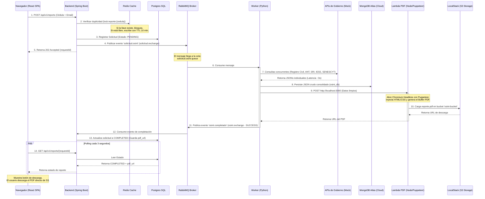

# Guía de Integración Completa: Ecosistema OSINT Ecuador (v3)

Este documento sirve como la guía técnica definitiva para desarrolladores y evaluadores. Explica el funcionamiento integrado, la arquitectura de puertos, el flujo de datos de extremo a extremo (E2E) y los pasos para ejecutar y probar la interacción entre la **APP 1 (Worker + Lambda PDF)** y la **APP 2 (Portal Ciudadano)**.

---

## 🏗️ 1. Arquitectura del Ecosistema Integrado

El sistema funciona de manera desacoplada basada en eventos (EDA). La comunicación entre el Portal Ciudadano y el Motor de Extracción se realiza de forma asíncrona a través de colas de mensajería (RabbitMQ), garantizando resiliencia y alta disponibilidad.

### Mapa de Puertos y Servicios Locales

| Servicio | Componente | Puerto | Rol |
| :--- | :--- | :--- | :--- |
| **React SPA** | App 2 (Frontend) | `5173` | Interfaz pública del ciudadano. |
| **Spring Boot API** | App 2 (Backend) | `8080` | API REST de solicitudes y orquestador. |
| **PostgreSQL** | App 2 (DB) | `5432` | Persistencia relacional de solicitudes y usuarios. |
| **Redis** | App 2 (Cache) | `6379` | Control de idempotencia y bloqueo de doble submit. |
| **Mock Gobierno API** | App 1 (External Mock) | `8083` | Emula las APIs del Registro Civil, ANT, SRI, IESS y SENESCYT. |
| **Lambda PDF Express** | App 1 (PDF Engine) | `3000` | Servidor Node.js/Puppeteer que renderiza el reporte. |
| **RabbitMQ** | Transit (Broker) | `5672` / `15672` | Canal AMQP de eventos y panel de administración web. |
| **LocalStack S3** | Transit (Storage) | `4566` | Emulación local de AWS S3 para almacenamiento de PDFs. |
| **MongoDB Atlas** | App 1 (DB Cloud) | *Cloud* | Base documental en la nube para auditoría de datos crudos. |

---

## 🔄 2. Flujo de Datos End-to-End (E2E)

El siguiente flujo describe el camino de una solicitud exitosa:



---

## 🛠️ 3. Guía de Ejecución Local (Paso a Paso)

Ejecuta cada uno de los siguientes pasos en terminales independientes en el orden sugerido:

### Paso 1: Levantar la Infraestructura Docker (Común)
Asegúrate de tener Docker Desktop abierto y en ejecución. En la raíz del proyecto, ejecuta:
```powershell
docker compose up -d app2-postgres app2-redis app4-rabbitmq app4-localstack
```
*   *Nota: El contenedor `app1-mongodb` local es opcional y no necesita iniciarse ya que usaremos MongoDB Atlas.*

### Paso 2: Levantar el Servidor Mock de Gobierno (App 1)
En la raíz del proyecto, ejecuta:
```powershell
python app1-worker/worker/gov_mock.py
```
*   *Verificar*: Mostrará `Iniciando API de Gobierno Mock en el puerto 8083...`.

### Paso 3: Levantar la Lambda de Generación PDF (App 1)
1. Navega al directorio:
   ```powershell
   cd app1-worker/lambda-pdf
   ```
2. Instala dependencias (omitiendo la descarga pesada de Chromium en local):
   * En Command Prompt:
     ```cmd
     set PUPPETEER_SKIP_CHROMIUM_DOWNLOAD=true
     npm install
     ```
   * En PowerShell:
     ```powershell
     $env:PUPPETEER_SKIP_CHROMIUM_DOWNLOAD="true"
     npm install
     ```
3. Configura la ruta de tu navegador Chrome local y arranca el servidor:
   * En Command Prompt:
     ```cmd
     set PUPPETEER_EXECUTABLE_PATH=C:\Program Files\Google\Chrome\Application\chrome.exe
     npm start
     ```
   * En PowerShell:
     ```powershell
     $env:PUPPETEER_EXECUTABLE_PATH="C:\Program Files\Google\Chrome\Application\chrome.exe"
     npm start
     ```
*   *Verificar*: Mostrará `Servidor local Lambda PDF escuchando en el puerto 3000`.

### Paso 4: Levantar el Worker OSINT (App 1)
En la raíz del proyecto (con tu entorno de Python activo), ejecuta:
```powershell
pip install -r app1-worker/requirements.txt
python app1-worker/worker/app.py
```
*   *Verificar*: Mostrará `Worker listo y escuchando la cola solicitud.osint.queue...`.

### Paso 5: Levantar el Backend (App 2)
1. Navega al directorio del backend:
   ```powershell
   cd app2-portal/backend
   ```
2. Compila e inicia la aplicación Spring Boot con Maven global:
   ```powershell
   mvn spring-boot:run
   ```
*   *Verificar*: Verás el logo de Spring Boot en consola y al final dirá `Started PortalBackendApplication in ... seconds (Tomcat started on port 8080)`.

### Paso 6: Levantar el Frontend (App 2)
1. Navega al directorio del frontend:
   ```powershell
   cd app2-portal/frontend
   ```
2. Instala las dependencias de Node e inicia el servidor de desarrollo de Vite:
   ```powershell
   npm install
   npm run dev
   ```
*   *Verificar*: Mostrará que el portal está listo en `http://localhost:5173/`.

---

## 🧪 4. Validación de Integración y Casos de Prueba

1. Abre tu navegador e ingresa a **[http://localhost:5173/](http://localhost:5173/)**.
2. **Caso de Éxito**:
   * Cédula: **`1710034065`** (cédula válida real parametrizada en los mocks).
   * Correo: `tu-email@correo.com`.
   * Acción: Haz clic en **Consultar Antecedentes**.
   * *Resultado*: La UI entrará en carga y tras unos segundos el Worker terminará el flujo con éxito, mostrando el botón de descarga del PDF.
3. **Caso de Bloqueo por Idempotencia**:
   * Si intentas consultar la misma cédula antes de que pasen 10 minutos (o antes de que el proceso sea marcado en base de datos), el portal mostrará: *"Ya existe una solicitud en proceso para esta cédula."*
4. **Resetear Bloqueos de Prueba**:
   * Si necesitas forzar pruebas consecutivas con la misma cédula sin esperar el TTL de 10 minutos de Redis, ejecuta este comando en tu terminal para vaciar Redis:
     ```powershell
     docker exec -t app2-redis redis-cli flushall
     ```
