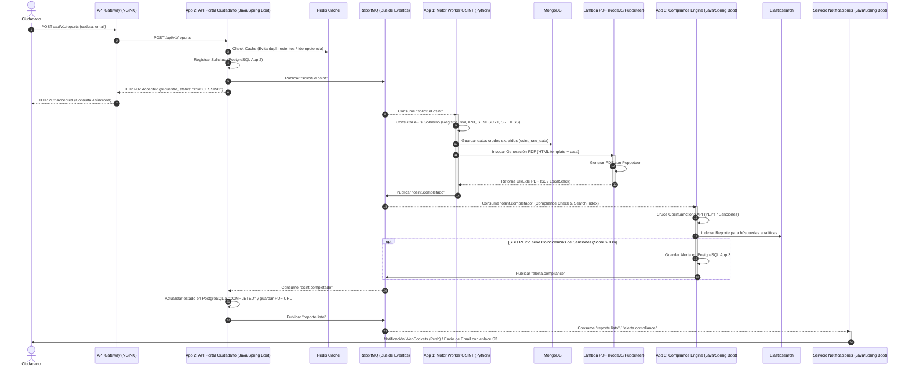
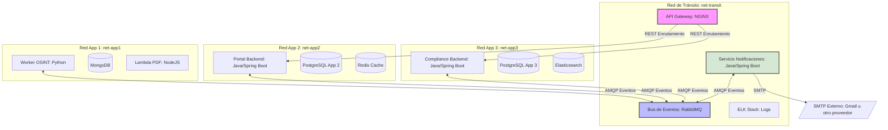

# Plan de Implementación: Plataforma OSINT Ecuador — Arquitectura EDA Desacoplada (v3)

Este documento detalla el plan de implementación técnica y la estrategia de paralelización para un equipo de 4 desarrolladores. El sistema es una plataforma de Inteligencia de Fuentes Abiertas (OSINT) diseñada bajo un enfoque de **Arquitectura Dirigida por Eventos (EDA)** y microservicios desacoplados, cumpliendo estrictamente con los límites de red, bases de datos independientes y flujos definidos en el blueprint.

A solicitud del Tech Lead, el stack para las APIs de Backend Web y Notificaciones se ha estandarizado en **Java (Spring Boot 3.x)** para maximizar la velocidad de desarrollo del equipo.

---

## 1. Diseño de Arquitectura y Topología

Para asegurar el total desacoplamiento, la plataforma se estructura en torno a un Bus de Eventos central (RabbitMQ) y un API Gateway (NGINX/Kong). Cada aplicación gestiona su propio ciclo de persistencia y se ejecuta en una red Docker aislada.

### Flujo de Eventos Global (EDA)
El siguiente diagrama detalla cómo fluyen los mensajes asíncronos entre los diferentes componentes al solicitar un reporte:



---

## 2. Definición del Tech Stack Global

De acuerdo con el blueprint de arquitectura, adaptado a la preferencia del equipo por el lenguaje Java para el desarrollo Web, se define el siguiente stack tecnológico:

| Componente | Stack Tecnológico | Justificación |
| :--- | :--- | :--- |
| **App 1 (Worker OSINT)** | Python 3.11, Motor (Async MongoDB), Pika / aio-pika | Python se mantiene para la extracción de datos debido a su enorme ecosistema y facilidad para web scraping/consumo de APIs (`httpx`, `beautifulsoup4`). |
| **App 1 (Lambda PDF)** | Node.js 20, Puppeteer, Chromium | Node.js + Puppeteer proporciona la mayor fidelidad de renderizado HTML5/CSS3 para PDF de forma serverless y eficiente. |
| **App 2 (Portal API)** | Java 17, Spring Boot 3.x, Spring Data JPA, Spring Data Redis, Spring AMQP | Reemplaza Node.js. Garantiza robustez corporativa, unificación de stack con App 3 y aprovecha al 100% el conocimiento de Java del equipo. |
| **App 2 (Portal Web)** | React.js (TypeScript), Tailwind CSS, Vite | Construcción de interfaces reactivas rápidas y estilizado dinámico sin sobrecarga. |
| **App 3 (Compliance API)** | Java 17, Spring Boot 3.x, Spring Data JPA / Elasticsearch | Java/Spring Boot ofrece la robustez transaccional y la integración madura requerida para motores de cumplimiento y Elasticsearch. |
| **App 3 (Dashboard)** | React.js (TypeScript), Tailwind CSS | Interfaz interactiva de consulta rápida conectada al motor de Elasticsearch. |
| **Servicio Transversal (Notif.)** | Java 17, Spring Boot 3.x (Spring WebSockets, Spring Mail), Spring AMQP | Reemplaza Node.js. Utiliza hilos de Spring AMQP y controladores de WebSocket integrados de Spring Security / WebSockets para notificaciones rápidas y seguras. |
| **API Gateway** | NGINX (con configuración WAF y Rate Limiting) | Ligero, robusto y fácil de configurar para enrutamiento y proxy reverso TLS. |
| **Bus de Eventos** | RabbitMQ (con RabbitMQ Management UI) | AMQP nativo, soporte de exchanges por tópicos, enrutamiento avanzado y colas DLQ. |

---

## 3. Detalle de los 4 Paquetes de Trabajo

### PAQUETE A (Persona 1): APP 1 — Motor Worker OSINT + Lambda PDF + MongoDB

#### 1. Objetivo del Paquete
Construir el motor de extracción de datos asíncrono en Python, persistir la información gubernamental estructurada sin esquema en MongoDB, e implementar la Lambda serverless en Node.js/Puppeteer para la generación y almacenamiento del reporte PDF.

#### 2. Alcance Técnico — Qué se debe construir
*   **Contenedor `app1-worker` (Python 3.11)**:
    *   No expone endpoints REST públicos. Consume de forma puramente asíncrona desde RabbitMQ.
    *   Cliente de RabbitMQ utilizando la librería asíncrona `aio-pika`.
    *   Conectores HTTP resilientes usando `httpx` para consultar las 5 APIs de gobierno simuladas:
        *   *Registro Civil*: Obtiene cédula, nombres completos, estado civil, fecha de nacimiento.
        *   *ANT*: Multas acumuladas (monto) y puntos de licencia (0-30).
        *   *SENESCYT*: Títulos universitarios, institución, fecha de registro.
        *   *SRI*: RUCs activos, estado tributario (al día o con deudas).
        *   *IESS*: Estado de afiliación, aportaciones acumuladas, empleador actual.
    *   Uso de la librería `tenacity` para implementar reintentos exponenciales con jitter y circuit breakers en caso de caídas de las APIs.
    *   Simulación de las APIs de gobierno mediante un servidor HTTP local en Python (mokeado) que responda con latencias variables.
*   **Contenedor `app1-mongodb` (MongoDB 6.0)**:
    *   Base de datos sin esquema para datos OSINT crudos.
    *   Colección `osint_raw_data` con índices en `targetId` (cédula) y `timestamp`.
*   **Lambda Serverless `pdf-generator` (Node.js 20 + Puppeteer)**:
    *   Contenedor empaquetado compatible con AWS Lambda (basado en `public.ecr.aws/lambda/nodejs:20`).
    *   Recibe los datos estructurados en formato JSON, inyecta la información en un template HTML5 moderno y responsivo, e inicia un navegador Chromium headless usando Puppeteer para renderizar y exportar el PDF.
    *   Sube el PDF generado a un bucket de AWS S3 (simulado en desarrollo con LocalStack S3) y retorna la URL pública del objeto.

#### 3. Contratos de Interfaz / Puntos de Integración
*   **Eventos Consumidos**:
    *   **Tópico / Routing Key**: `solicitud.osint` (desde RabbitMQ)
    *   **Payload Esperado**:
        ```json
        {
          "requestId": "5ff1df21-7e8c-4a30-8919-42b7a0f7c222",
          "targetId": "1712345678",
          "requesterEmail": "ciudadano@mail.com",
          "timestamp": 1782813385000
        }
        ```
*   **Invocación a la Lambda PDF**:
    *   **Payload de entrada**: JSON con los datos agregados extraídos de las APIs gubernamentales y el `requestId`.
    *   **Retorno esperado**: `{ "pdfUrl": "https://s3.amazonaws.com/osint-bucket/reports/1712345678-5ff1df21.pdf" }`
*   **Eventos Publicados**:
    *   **Tópico / Routing Key**: `osint.completado`
    *   **Payload Publicado**:
        ```json
        {
          "requestId": "5ff1df21-7e8c-4a30-8919-42b7a0f7c222",
          "targetId": "1712345678",
          "pdfUrl": "https://s3.amazonaws.com/osint-bucket/reports/1712345678-5ff1df21.pdf",
          "status": "SUCCESS",
          "completedAt": 1782813405000,
          "data": {
            "fullName": "JUAN PEREZ ALBUJA",
            "birthDate": "1990-05-15",
            "civilStatus": "SOLTERO",
            "ant": { "points": 28, "fines": 0.0 },
            "senescyt": [{ "title": "INGENIERO EN SISTEMAS", "university": "EPN" }],
            "sri": { "hasRuc": true, "taxStatus": "AL DIA" },
            "iess": { "isAffiliated": true, "contributions": 120 }
          }
        }
        ```

#### 4. Dependencias Explícitas y Estrategia de Mock
*   **Depende de**: Paquete D para proveer el broker RabbitMQ operativo en la red de tránsito y el contenedor de LocalStack (S3) configurado.
*   **Estrategia de Mock**: Para trabajar de forma aislada sin depender del Portal (Paquete B), la Persona 1 implementará un script CLI `publish_test_request.py` que inyectará mensajes directamente en la cola `solicitud.queue`. También utilizará mocks en formato JSON local para simular las respuestas de las APIs externas.

#### 5. Documentación Específica del Paquete
*   Diagrama C4 de nivel de Componente para `App 1 (OSINT Worker y Lambda)`.
*   Esquema JSON/BSON documentado de la colección `osint_raw_data`.
*   Dockerfile optimizado multi-stage para el Worker de Python y Dockerfile adaptado para Lambda PDF (incluyendo librerías necesarias de Linux para la ejecución de Chromium Headless).
*   Especificación detallada de reintentos y control de concurrencia en la extracción.

#### 6. Criterios de Aceptación (DoD)
*   El worker de Python inicia, se conecta a RabbitMQ y MongoDB locales sin errores.
*   Al recibir un evento `solicitud.osint`, procesa de forma concurrente (usando asyncio) las llamadas HTTP a las APIs de gobierno mockeadas.
*   Los datos estructurados agregados se guardan correctamente en MongoDB.
*   La Lambda local compila, genera un PDF con Puppeteer y lo sube exitosamente a LocalStack S3.
*   Se publica el evento `osint.completado` en RabbitMQ conteniendo el payload correcto con la URL del PDF y los metadatos.

#### 7. Riesgos Específicos y Mitigación
*   *Riesgo 1*: Bloqueo de IPs o sobrecarga de APIs externas. *Mitigación*: Implementar políticas estrictas de rate-limiting interno por API (ej. máximo 5 peticiones concurrentes) y reintentos con backoff exponencial.
*   *Riesgo 2*: Consumo excesivo de memoria por Puppeteer (Chromium). *Mitigación*: Desplegar como AWS Lambda (arquitectura serverless elástica) y optimizar el ciclo de vida del navegador (cerrar instancias de Chromium tras cada renderizado utilizando cláusulas try/finally).

---

### PAQUETE B (Persona 2): APP 2 — Portal Ciudadano (SPA + API Backend Java) + Redis + PostgreSQL

#### 1. Objetivo del Paquete
Construir el Portal Ciudadano (SPA) en React y su Backend API en **Java/Spring Boot**, gestionando el control de duplicidad por caché en Redis y registrando los reportes y su historial en PostgreSQL.

#### 2. Alcance Técnico — Qué se debe construir
*   **Portal Ciudadano SPA (React.js + Tailwind CSS)**:
    *   Página de inicio limpia y moderna para solicitud de reportes.
    *   Formulario para ingresar la Cédula de Identidad y el Correo Electrónico.
    *   Validación en cliente del número de cédula ecuatoriano utilizando el algoritmo de módulo 10.
    *   Pantalla de estado en tiempo real que realice consultas periódicas (polling corto) o se conecte al servicio de WebSockets de notificaciones para actualizar el progreso de la solicitud.
*   **Portal Backend API (Java 17 + Spring Boot 3.x)**:
    *   Expone endpoints REST-full documentados con OpenAPI (Springdoc OpenAPI / Swagger).
    *   Implementa control de concurrencia e **Idempotencia** usando Redis a través de `Spring Data Redis` (RedisTemplate): antes de procesar una solicitud, busca en Redis si hay un reporte reciente para esa cédula (clave `lock:reporte:{cedula}` con TTL de 10 minutos). Si existe, bloquea la solicitud retornando la información de la existente.
    *   Guarda los registros de solicitudes en PostgreSQL utilizando Spring Data JPA y Hibernate.
    *   Publica el evento `solicitud.osint` en RabbitMQ usando `RabbitTemplate` (Spring AMQP) al recibir una solicitud válida.
    *   Consume el evento `osint.completado` usando `@RabbitListener` para actualizar el estado del reporte en PostgreSQL a `COMPLETED` y guardar la URL del PDF final.
*   **Persistencia Local**:
    *   Contenedor `app2-postgres` (PostgreSQL 15) exclusivo para datos transaccionales del portal.
    *   Contenedor `app2-redis` (Redis 7) exclusivo para control de caché y bloqueos de idempotencia.

#### 3. Contratos de Interfaz / Puntos de Integración
*   **Endpoints Expuestos hacia el Gateway**:
    *   `POST /api/v1/reports`: Crea una solicitud.
        *   *Request Body*: `{ "cedula": "1712345678", "email": "ciudadano@mail.com" }`
        *   *Response (HTTP 202 Accepted)*: `{ "requestId": "5ff1df21-7e8c-4a30-8919-42b7a0f7c222", "status": "PROCESSING", "createdAt": 1782813385000 }`
        *   *Response (HTTP 409 Conflict)*: Si hay un reporte en proceso para esa cédula.
    *   `GET /api/v1/reports/{requestId}`: Consulta el estado del reporte.
        *   *Response (HTTP 200 OK)*: `{ "requestId": "5ff1df21-7e8c-4a30-8919-42b7a0f7c222", "cedula": "1712345678", "status": "COMPLETED", "pdfUrl": "https://s3.amazonaws.com/osint-bucket/reports/1712345678-5ff1df21.pdf", "completedAt": 1782813405000 }`
*   **Eventos Publicados**:
    *   `solicitud.osint` (ver estructura en Paquete A).
*   **Eventos Consumidos**:
    *   **Tópico / Routing Key**: `osint.completado` (ver estructura en Paquete A) para actualizar el estado a completado.
    *   **Tópico / Routing Key**: `reporte.listo` (una vez actualizado el estado en Postgres, App 2 publica este evento para que el servicio de notificaciones envíe alertas).
        *   *Payload Publicado*:
            ```json
            {
              "requestId": "5ff1df21-7e8c-4a30-8919-42b7a0f7c222",
              "pdfUrl": "https://s3.amazonaws.com/osint-bucket/reports/1712345678-5ff1df21.pdf",
              "email": "ciudadano@mail.com",
              "status": "COMPLETED"
            }
            ```

#### 4. Dependencias Explícitas y Estrategia de Mock
*   **Depende de**: Paquete D (API Gateway y bus RabbitMQ configurado).
*   **Estrategia de Mock**: Para no depender de que el Worker (Paquete A) esté listo, la Persona 2 usará una cola RabbitMQ temporal o un script local para publicar el evento `osint.completado` con datos falsos de forma manual y corroborar que el backend en Spring Boot procesa el estado y publica `reporte.listo` correctamente.

#### 5. Documentación Específica del Paquete
*   Diagrama C4 de nivel de Componente para `App 2 (Portal Frontend + Backend Java)`.
*   Definición de Contratos OpenAPI 3.0 autogenerados por Springdoc e integrados en SwaggerHub.
*   Esquema SQL de las tablas `requests` y `users`.
*   Dockerfile optimizado multi-stage para Java (compilación con Maven/Gradle Wrapper y ejecución en JDK slim) y un Dockerfile multi-stage basado en NGINX para servir la SPA de React compilada.
*   Análisis y justificación del TTL en Redis.

#### 6. Criterios de Aceptación (DoD)
*   El frontend carga correctamente en un navegador local y valida la cédula según el algoritmo de módulo 10.
*   El endpoint REST expuesto por Spring Boot `POST /api/v1/reports` recibe peticiones, las guarda en Postgres, crea la clave en Redis y publica en RabbitMQ en < 120ms.
*   Llamadas duplicadas dentro de los 10 minutos para la misma cédula reciben una respuesta HTTP 409 o redirigen a la solicitud en proceso.
*   El listener `@RabbitListener` consume con éxito el evento `osint.completado`, actualiza la base de datos a `COMPLETED` y publica el evento `reporte.listo`.

#### 7. Riesgos Específicos y Mitigación
*   *Riesgo*: Fugas de conexiones en el Pool JDBC de Spring Boot bajo alta concurrencia. *Mitigación*: Configurar un pool HikariCP con tamaño optimizado y timeouts adecuados, habilitando logs de métricas en Actuator.

---

### PAQUETE C (Persona 3): APP 3 — Dashboard Monitor Compliance + PostgreSQL + Elasticsearch

#### 1. Objetivo del Paquete
Desarrollar el Dashboard Compliance (SPA) en React y su backend en Java/Spring Boot para indexar los datos de reportes finalizados en Elasticsearch, cruzarlos contra OpenSanctions (PEPs y Sancionados) y generar las alertas correspondientes.

#### 2. Alcance Técnico — Qué se debe construir
*   **Compliance API Backend (Java 17 + Spring Boot 3.x)**:
    *   Expone endpoints REST-full internos para analistas.
    *   Consume de forma asíncrona el evento `osint.completado` con `@RabbitListener`.
    *   **Motor de Compliance (Compliance Engine)**:
        *   Integra mediante clientes HTTP (`WebClient` reactivo) la API de **OpenSanctions** (usando el endpoint `/match` con algoritmos de coincidencia aproximada o fuzzy matching).
        *   Si el score retornado es > 0.8 (coincidencia de 80% o superior en PEP o listas de sancionados internacionales/locales):
            *   Guarda una alerta en PostgreSQL App 3 con estado `PENDING_REVIEW` y los detalles del match.
            *   Publica el evento `alerta.compliance` en el bus de RabbitMQ.
    *   **Indexador Elasticsearch**:
        *   Indexa la información metadatos y textual consolidada del reporte OSINT en un índice local de Elasticsearch usando `Spring Data Elasticsearch`.
        *   Expone una API de búsqueda de texto completo rápida conectada al frontend.
*   **Persistencia Local**:
    *   Contenedor `app3-postgres` (PostgreSQL 15) exclusivo para alertas de compliance y auditoría de decisiones.
    *   Contenedor `app3-elasticsearch` (Elasticsearch 8.x) exclusivo para almacenamiento de índices de búsqueda rápida y fuzzy search analítica de reportes.
*   **Compliance Dashboard SPA (React.js + Tailwind CSS)**:
    *   Acceso exclusivo para analistas/ONG/empresas (simulado con auth JWT).
    *   Muestra el feed en tiempo real de alertas de compliance generadas.
    *   Caja de búsqueda avanzada (búsqueda tipo Google) que consulte a Elasticsearch para filtrado instantáneo por nombre, cédula, universidad, empleador, etc.

#### 3. Contratos de Interfaz / Puntos de Integración
*   **Endpoints Expuestos hacia el Gateway**:
    *   `GET /api/v1/compliance/alerts`: Lista alertas de alto riesgo.
    *   `GET /api/v1/compliance/search?q={query}`: Búsqueda avanzada contra Elasticsearch.
*   **Eventos Consumidos**:
    *   `osint.completado` (ver estructura en Paquete A).
*   **Eventos Publicados**:
    *   **Tópico / Routing Key**: `alerta.compliance`
    *   **Payload Publicado**:
        ```json
        {
          "alertId": "bc11df21-7e8c-4a30-8919-42b7a0f7c999",
          "requestId": "5ff1df21-7e8c-4a30-8919-42b7a0f7c222",
          "targetId": "1712345678",
          "fullName": "JUAN PEREZ ALBUJA",
          "riskLevel": "HIGH",
          "matchReason": "Coincidencia 89% con lista de PEPs/Sanciones en OpenSanctions (Q283719)",
          "timestamp": 1782813410000
        }
        ```

#### 4. Dependencias Explícitas y Estrategia de Mock
*   **Depende de**: Paquete D (Elasticsearch infra, RabbitMQ, API Gateway) y Paquete A (publicación del evento completado con los datos de personas).
*   **Estrategia de Mock**: Para el desarrollo inicial sin incurrir en costos/límites de OpenSanctions API, la Persona 3 implementará un servicio local mockeado en Spring Boot (`OpenSanctionsMock`) que compare nombres contra una lista estática en un archivo JSON (ej. si el nombre contiene "Perez", retorna positivo; de lo contrario, negativo).

#### 5. Documentación Específica del Paquete
*   Diagrama C4 de nivel de Componente para `App 3 (Compliance App)`.
*   Mapeo de índice Elasticsearch (`mapping.json`) con analizadores de texto fonético y español (`spanish_analyzer`).
*   OpenAPI 3.0 de los endpoints de búsqueda y alertas.
*   Dockerfile multi-stage para Spring Boot (construcción con Maven/Gradle y ejecución en JRE slim) y React (con Nginx).
*   Análisis y justificación del uso de Elasticsearch sobre bases de datos relacionales tradicionales para búsqueda.

#### 6. Criterios de Aceptación (DoD)
*   El backend de compliance lee con éxito el evento `osint.completado` de la cola de RabbitMQ.
*   Se ejecuta la validación cruzada y los registros que superan el score guardan la alerta en PostgreSQL y emiten el evento `alerta.compliance`.
*   El reporte OSINT se indexa correctamente en Elasticsearch y se puede recuperar instantáneamente mediante búsquedas por texto libre.
*   El dashboard web de React renderiza el buscador de reportes y la lista de alertas interactivas sin errores de consola.

#### 7. Riesgos Específicos y Mitigación
*   *Riesgo*: Falsos positivos severos debido a homónimos comunes en Ecuador. *Mitigación*: Ajustar el algoritmo de score en Spring Boot para ponderar adicionalmente datos de fecha de nacimiento (edad) y ocupación si están disponibles en el reporte OSINT crudo.

---

### PAQUETE D (Persona 4): Plataforma e Integración Transversal + Seguridad + Notificaciones (Java) + Infra + Documentación Global

#### 1. Objetivo del Paquete
Proveer la infraestructura de red en contenedores Docker, la mensajería asíncrona estructurada con políticas de reintento en RabbitMQ, el enrutamiento centralizado en el API Gateway, la centralización de logs (ELK), el Servicio de Notificaciones en tiempo real en **Java/Spring Boot**, y liderar la consolidación técnica y arquitectónica del proyecto global.

#### 2. Alcance Técnico — Qué se debe construir
*   **API Gateway (NGINX/Kong)**:
    *   Configura el enrutamiento reverso seguro.
    *   Exposición de SwaggerHub centralizada de todas las APIs.
    *   Configuración de Rate Limiting por dirección IP (ej. máx. 20 peticiones/minuto) para mitigar DDoS.
    *   Configuración de TLS en tránsito usando certificados autofirmados locales.
*   **Bus de Eventos (RabbitMQ Broker)**:
    *   Contenedor Docker basado en `rabbitmq:3-management` configurado mediante scripts de inicio automatizados (`rabbitmq.conf` y definiciones JSON).
    *   Crea el exchange principal `osint.exchange` (tipo Topic).
    *   Crea las colas y los bindings asociados:
        *   `solicitud.queue` vinculada al binding `solicitud.osint`.
        *   `completado.queue` vinculada al binding `osint.completado`.
        *   `alerta.queue` vinculada al binding `alerta.compliance`.
        *   `notificacion.queue` vinculada a los bindings `reporte.listo` y `alerta.compliance`.
    *   **Manejo de Errores (Dead Letter Exchange)**: Configura `osint.dlx` de tipo directo, y las colas `solicitud.dlq`, `completado.dlq` para aislar mensajes corruptos tras 3 reintentos.
*   **Servicio de Notificaciones (Java 17 + Spring Boot 3.x + WebSockets + Spring Mail)**:
    *   Contenedor `app-notifications` (Spring Boot) conectado a la red de tránsito.
    *   Usa Spring AMQP (`@RabbitListener`) para consumir de la cola `notificacion.queue`.
    *   Expone endpoints WebSocket mediante `Spring WebSockets` con protocolo STOMP (o WS nativo) para notificaciones rápidas y seguras.
    *   Al recibir `reporte.listo`: envía un correo electrónico real usando `spring-boot-starter-mail` (SMTP, por defecto Gmail vía credenciales en `.env` local) con el enlace del PDF adjunto, y difunde vía WebSocket a la suscripción del ciudadano `/topic/reports/{requestId}`.
    *   Al recibir `alerta.compliance`: envía una alerta push de alta prioridad vía WebSocket al canal de cumplimiento `/topic/compliance/alerts`.
*   **Observabilidad centralizada (ELK Stack)**:
    *   Contenedores Docker para Elasticsearch (compartido o separado de App 3), Logstash y Kibana.
    *   Configura los demonios Docker para exportar logs en formato JSON de todas las aplicaciones directamente a Logstash.
*   **Infraestructura Multi-Red Docker**:
    *   Mantiene el archivo `docker-compose.yml` unificado que orquesta la topología de red aislada de la plataforma:
        *   `net-app1` (Motor Worker OSINT, MongoDB).
        *   `net-app2` (Portal React/Backend, Postgres, Redis).
        *   `net-app3` (Compliance React/Backend, Postgres, Elasticsearch).
        *   `net-transit` (API Gateway, RabbitMQ, Notificaciones, ELK).
        *   *Aislamiento estricto*: Las redes de las apps no tienen comunicación directa entre sí; todo tráfico inter-app pasa exclusivamente por el bus de eventos RabbitMQ en `net-transit`.



#### 3. Contratos de Interfaz / Puntos de Integración
*   **Enrutamiento de Endpoints en el Gateway**:
    *   `/api/v1/reports/**` -> Enruta a `app2-portal-api:8080/api/v1/reports/**`
    *   `/api/v1/compliance/**` -> Enruta a `app3-compliance-api:8081/api/v1/compliance/**`
    *   `/ws/**` -> Proxy reverso para WebSockets de `app-notifications:8082/ws/**`
*   **Eventos Consumidos (Servicio de Notificación)**:
    *   `reporte.listo` (ver estructura en Paquete B).
    *   `alerta.compliance` (ver estructura en Paquete C).

#### 4. Dependencias Explícitas y Estrategia de Mock
*   **Depende de**: Ningún paquete de desarrollo de aplicaciones para arrancar. Sin embargo, para validar el API Gateway y el ELK stack en su totalidad, necesita los contenedores funcionales de los Paquetes A, B y C.
*   **Estrategia de Mock**: Para entregar la base en el Día 2 del proyecto, proveerá los contenedores de RabbitMQ y NGINX configurados con servicios dummy en los puertos de destino, permitiendo a los otros desarrolladores conectarse de forma transparente.

#### 5. Documentación Específica del Paquete
*   Diagrama C4 global a nivel de **Contexto** y **Contenedor** del sistema consolidado (en Icepanel).
*   Diagrama de topología de infraestructura general y redes Docker.
*   Plantillas YAML de GitHub Actions para CI/CD de cada una de las aplicaciones.
*   Consolidación del análisis de Atributos de Calidad globales.

#### 6. Criterios de Aceptación (DoD)
*   El comando `docker-compose up -d` arranca la red de tránsito, RabbitMQ, Gateway, Notificaciones y el ELK stack sin errores.
*   Las redes Docker se crean aisladas y un test de red (ping) entre `app1-worker` y `app3-postgres` falla según el diseño perimetral.
*   El API Gateway expone puertos SSL, aplica políticas de CORS y Rate Limiting a las solicitudes de entrada.
*   El servicio de notificaciones reacciona a eventos en `notificacion.queue`, enviando correctamente WebSockets a clientes web y correos electrónicos reales vía SMTP.
*   Se visualizan logs estructurados en Kibana en tiempo real de los contenedores de la plataforma.

#### 7. Riesgos Específicos y Mitigación
*   *Riesgo*: Sobrecarga de memoria de la máquina de desarrollo al correr todo el ecosistema (ELK, 3 DBs, RabbitMQ, 3 Backends, 2 Frontends). *Mitigación*: Proveer configuraciones de límite de memoria RAM en el `docker-compose.yml` para Elasticsearch, Kibana y JVMs, y permitir desactivar el ELK stack en desarrollo si los recursos del equipo son limitados.

---

## 4. Matriz de Dependencias entre Paquetes

Esta tabla resume de manera directa el flujo de dependencias para evitar cuellos de botella en paralelo:

| Paquete / Desarrollador | Depende Directamente De | Qué Necesita de Ellos | Alternativa de Mock para Desarrollo Autónomo |
| :--- | :--- | :--- | :--- |
| **Paquete A** (Worker) | **Paquete D** (Plataforma) | Broker RabbitMQ en red de tránsito y contenedor de S3 (LocalStack) | Iniciar contenedor RabbitMQ + S3 de forma local con Docker manual |
| **Paquete B** (Portal) | **Paquete D** (Plataforma) | Routing de API Gateway y bus RabbitMQ configurado | Correr API Backend localmente en localhost y mockear cabeceras JWT |
| **Paquete B** (Portal) | **Paquete A** (Worker) | Publicación de `osint.completado` con datos agregados | Publicar un evento `osint.completado` dummy a RabbitMQ usando script |
| **Paquete C** (Compliance) | **Paquete D** (Plataforma) | RabbitMQ, API Gateway y base Elasticsearch operacional | Levantar instancias individuales en Docker local de Elasticsearch y RabbitMQ |
| **Paquete C** (Compliance) | **Paquete A** (Worker) | Evento `osint.completado` con datos estructurados de personas | Inyectar un mensaje manual JSON con nombres reales y comunes en la cola |
| **Paquete D** (Plataforma) | **Paquetes A, B, C** | Código e imágenes de contenedores para probar el despliegue integrado | Usar contenedores dummy (imágenes Nginx básicas) que escuchen en los mismos puertos |

---

## 5. Cronograma Sugerido por Fases

El proyecto está diseñado para ejecutarse en **4 semanas (28 días)**, con puntos de control claros y paralelizables:

```mermaid
gantt
    title Cronograma de Implementación (4 Semanas)
    dateFormat  D
    axisFormat %d
    
    section Fase 0: Contratos
    Definición de Contratos, JSONs y Puertos (Todos) :active, des1, 1, 3
    Setup Inicial de RabbitMQ & Compose Base (Des. D) : des2, 2, 4
    
    section Fase 1: Desarrollo
    Paquete A: Worker, Scraping, Lambda PDF, Mongo   : a1, 4, 15
    Paquete B: Portal SPA, Backend Java, PG, Redis    : b1, 4, 15
    Paquete C: Compliance Engine, ES, Postgres, SPA   : c1, 4, 15
    Paquete D: API Gateway, Notificaciones Java, ELK  : d1, 4, 15
    
    section Fase 2: Integración
    Integración E2E en Redes Docker Aisladas (Todos) :active, e2e, 16, 20
    
    section Fase 3: Hardening
    TLS, Reglas WAF, CI/CD, Documentación C4 (Todos)  : hard, 21, 25
    
    section Fase 4: Demo
    Pruebas de Carga, Grabación Demo, Cierre (Todos) : demo, 26, 28
```

*   **Puntos de Sincronización Obligatorios**:
    *   **Día 3**: Aprobación colectiva del C4 de Contexto y Contenedores y los esquemas JSON de los eventos en RabbitMQ.
    *   **Día 15**: Demostración interna con mocks de cada paquete para asegurar que los contratos OpenAPI y de eventos encajen.
    *   **Día 20**: Cierre del flujo End-to-End integrado.
    *   **Día 25**: Code Freeze y congelación de diagramas arquitectónicos.

---

## 6. Checklist Consolidado de Requisitos Obligatorios

| Requisito del Proyecto | Tipo | ¿En qué Paquete se cumple? | Responsable de la Entrega |
| :--- | :--- | :--- | :--- |
| **Capas de datos en contenedores Docker** | Técnico | Paquete A (MongoDB), Paquete B (Postgres & Redis), Paquete C (Postgres & Elasticsearch) | Desarrolladores A, B, C |
| **App con Lambda (Serverless PDF)** | Técnico | Paquete A (NodeJS + Puppeteer empaquetado para AWS Lambda) | Desarrollador A |
| **Gestor de Colas (RabbitMQ)** | Técnico | Paquete D (Configuración de Exchanges, Colas y DLQ de RabbitMQ) | Desarrollador D |
| **API Gateway con Swagger/SwaggerHub** | Técnico | Paquete D (Configuración NGINX) + Contratos de Paquetes B y C | Desarrollador D / Todos |
| **C4 en Icepanel** | Documental | Paquete D (Context/Container) + Paquetes A, B, C (Components) | Todos (Consolida Persona D) |
| **Diagrama de Infraestructura / Despliegue** | Documental | Paquete D (Topología de redes y contenedores Docker Compose) | Desarrollador D |
| **Análisis de Atributos de Calidad** | Documental | Consolidado global en Paquete D con antes específicos de A, B y C | Desarrollador D (Consolida) |

*   **Recomendación de Integrador**: Se designa formalmente al **Desarrollador 4 (Paquete D)** como el **Integrador Técnico e Integrador de Documentación (Tech Lead Adjunto)**. Al tener a su cargo el API Gateway, la centralización de logs (ELK) y el Bus de Eventos común, cuenta con la visual global para asegurar que las interconexiones sean fluidas y consistentes.

---

## 7. Análisis Arquitectónico de Atributos de Calidad

Este análisis justifica detalladamente las decisiones tomadas para satisfacer los requisitos del sistema ecuatoriano:

### 1. Caché (Responsable: Paquete B)
*   **Estrategia**: Se utiliza Redis 7 como caché en el Portal Ciudadano empleando el patrón **Cache-Aside**.
*   **Justificación**: Previene ataques de denegación de servicio (DDoS) involuntarios o intencionales que saturen el backend y el motor worker de extracción OSINT.
*   **Políticas de TTL**: Se define una clave `lock:reporte:{cedula}` con un TTL de **10 minutos** para actuar como bloqueo de idempotencia de solicitudes activas. Una vez que el reporte se procesa y completa con éxito, se cachea con un TTL de **24 horas** en MongoDB; si se realiza una consulta idéntica en ese lapso de tiempo, la API Portal Ciudadano devuelve la URL de S3 existente reduciendo a 0 la latencia de procesamiento.

### 2. Balanceo de Carga (Responsable: Paquete D)
*   **Estrategia**: Balanceo perimetral a través del API Gateway (NGINX) y balanceo por competencia en colas con RabbitMQ.
*   **Justificación**: NGINX actúa como balanceador round-robin primario, enrutando de forma balanceada a nivel HTTP hacia las réplicas del Backend Portal (App 2) y el Compliance Engine (App 3). A nivel de procesamiento asíncrono, RabbitMQ actúa como balanceador natural: si el Worker OSINT (App 1) se escala horizontalmente a múltiples contenedores Docker, RabbitMQ distribuye equitativamente las tareas de la cola mediante políticas de prefetch limitado (`basic.qos`), impidiendo que un solo worker se sature.

### 3. Indexación y Búsqueda (Responsable: Paquete C)
*   **Estrategia**: Elasticsearch 8.x indexa metadatos y contenido textual de los reportes generados.
*   **Justificación**: Las búsquedas en bases relacionales mediante `LIKE` son lentas, bloqueantes e ineficientes para textos extensos. Elasticsearch permite realizar búsquedas complejas con un analizador fonético en español (`spanish_analyzer`), resolviendo variaciones tipográficas en nombres y apellidos para alertas analíticas de PEPs y sanciones de forma instantánea (latencia inferior a 150ms).

### 4. Redundancia y Disponibilidad (Responsable: Paquete D)
*   **Estrategia**: Desacoplamiento temporal con colas persistentes y bases de datos aisladas.
*   **Justificación**: Si el Worker OSINT (App 1) o la Lambda PDF sufren caídas, el Portal Ciudadano (App 2) sigue operativo recibiendo solicitudes, las cuales se acumulan de forma segura en la cola RabbitMQ. Al tener cada aplicación su base de datos dedicada (MongoDB en App 1, Postgres en App 2 y 3, Elasticsearch en App 3), se elimina el punto único de fallo (SPOF) en la capa de datos.

### 5. Concurrencia y Latencia (Responsable: Paquetes A y C)
*   **Estrategia**: Procesamiento asíncrono y uso de WebClient / Clientes no bloqueantes.
*   **Justificación**: La latencia promedio de consulta directa a 5 APIs gubernamentales externas puede variar entre 5 y 15 segundos. Responder al ciudadano sincrónicamente mantendría hilos HTTP bloqueados y causaría timeout. Con el modelo EDA, el Portal responde con HTTP 202 (Accepted) en menos de 200ms, y procesa la solicitud asíncronamente. La comunicación final mediante WebSockets al usuario mitiga la latencia percibida al mínimo.

### 6. Costo y Proyección (Responsable: Paquete D / Todos)
*   **Estrategia**: Modelo híbrido Microservicios en contenedores y PDF como FaaS (Serverless).
*   **Justificación**: Los backends y los workers OSINT tienen demandas constantes y predecibles de CPU, ideales para microservicios corriendo en Docker. Por otro lado, la generación de PDFs mediante Puppeteer/Chromium es un proceso pesado que genera picos intermitentes de recursos. Implementar este último componente como una AWS Lambda serverless asegura que solo pagamos por los segundos de cómputo consumidos durante la renderización, reduciendo significativamente los costos de infraestructura a gran escala.

### 7. Performance y Escalabilidad (Responsable: Todos)
*   **Estrategia**: Escalado horizontal selectivo de componentes sin afectar el rendimiento global.
*   **Justificación**: Gracias a la arquitectura desacoplada y la comunicación mediante RabbitMQ, si hay un aumento repentino de ciudadanos solicitando reportes, se puede escalar de manera independiente el Portal API (App 2) y el Worker OSINT (App 1) duplicando sus contenedores, sin necesidad de escalar el motor de Compliance (App 3), optimizando los recursos del clúster Docker.
